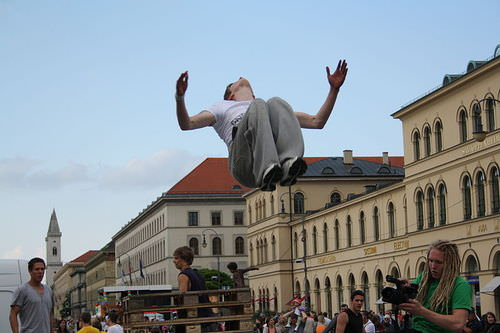
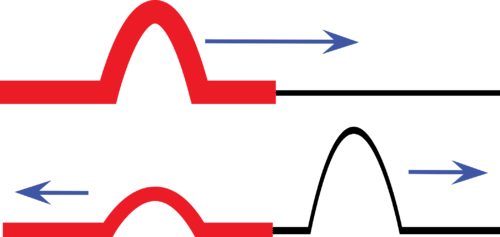

<!--
author:   Anuradha Mathur; Vasant Vihar; Vandita Shukla 

email:    LiaScript@web.de

version:  0.0.1

language: en

narrator: US English Female

comment:  This physics text was created using CK-12 resources to be seed content for a complete Physics Class 9 course for CBSE students.

logo:     ../cover.jpg

tags:      physics, science, cbse

-->

# CK-12 CBSE Physics Class 9

> This document was automatically translated to LiaScript from
>
> https://www.ck12.org/book/cbse_physics_book_class_ix/

## 1.0 Motion - CBSE Physics Class IX

<article>

</article>

### 1.1 Motion

<article>

### Defining Motion

In science, **motion** is defined as a change in position. An object’s position is its location. Besides the wings of the hummingbird in opening image, you can see other examples of motion in the figure below. In each case, the position of something is changing.

\[Figure 2\]---

**Q**: In each picture in the figure above, what is moving and how is its position changing?

**A**: The train and all its passengers are speeding straight down a track to the next station. The man and his bike are racing along a curving highway. The geese are flying over their wetland environment. The meteor is shooting through the atmosphere toward Earth, burning up as it goes.

#### Frame of Reference

There’s more to motion than objects simply changing position. You’ll see why when you consider the following example. Assume that the school bus pictured in the figure below passes by you as you stand on the sidewalk. It’s obvious to you that the bus is moving, but what about to the children inside the bus? The bus isn’t moving relative to them, and if they look at the other children sitting on the bus, they won’t appear to be moving either. If the ride is really smooth, the children may only be able to tell that the bus is moving by looking out the window and seeing you and the trees whizzing by.

</article>

### 1.2 Position and Displacement

<article>

Position is the location of the object (whether it's a person, a ball or a particle) at a given moment in time. Displacement is the difference in the object's position from one time to another. Distance is the total amount the object has traveled in a certain period of time. Displacement is a vector quantity (direction matters), where as distance is a scalor (only the amount matters). Distance and displacement are the same in the case where the object travels in a straight line and always moving in the same direction.

#### Example 1

**Problem:** An indecisive car goes 120 m North, then 30 m south then 60 m North. What is the car's distance and displacement?

**Solution:**

Distance is the total amount traveled. Thus distance = 120 + 30 + 60 m = 210 m

Displacement is the amount displaced from the starting position. Thus displacement = 120 - 30 + 60 m = 150 m.

#### Example 2

**Problem:** A boy goes 3 m towards the back wall of a room and after some time moves 2 m towards the front wall, why is his displacement not equal to the distance he has moved.

---

**Solution:**

Displacement 1 m towards Back Wall.

Distance is the total amount traveled. Thus distance = 2 m + 3 m = 5 m

#### Watch this Explanation

Watch the video at: https://www.youtube.com/watch?v=UhxAkYtLfQo

### Position and Displacement

Students will learn the meaning of an object's position, the difference between distance and displacement and some basic graphing of position vs. time.

#### Key Equations

$$
\begin{align*}
\text{Symbols}\begin{cases}
\Delta \text{(anything)} & \text{Final value - initial value}\\
\text{anything}_0 & \text{Value at time 0}
\end{cases}
\end{align*}
$$

$$
\begin{align*}
\text{Scalors}\begin{cases}
t & \text{Time in seconds, s}\\
d = |{\Delta x_1}| + |{\Delta x_2}| & \text{Distance (in meters, m}\text{)}\\
v = |{v}| & \text{Speed (in meters per second,}\ \text{m}/\text{s}\text{)}
\end{cases}
\end{align*}
$$

$$
\begin{align*}
\text{Vectors}\begin{cases}
x = x(t) & \text{Position} \\
\Delta x = x_f-x_i  & \text{Displacement}\\
\end{cases}
\end{align*}
$$

When beginning a one dimensional problem, define a positive direction. The other direction is then taken to be negative. Traditionally, “positive” is taken to mean “to the right”; however, any definition of direction used consistently throughout the problem will yield the right answer.

#### Time for Practice

1. What is the difference between distance $d$ and displacement $\triangle x$ Write a few sentences explaining this.

2. Does the odometer reading in a car measure distance or displacement?

3. Imagine a fox darting around in the woods for several hours. Can the displacement $\triangle x$ of the fox from his initial position ever be larger than the total distance $d$ he traveled? Explain.

4. Your brother borrowed the scissors from your room and now you want to use them. Do you care about the distance the scissors have traveled or their displacement? Explain your answer.

5. You’re trying to predict how long it’s going to take to get to Mumbai for the long weekend. Do you care about the distance you’ll travel or your displacement? Explain your answer.

**Answers**

1. discuss in class

2. distance

3. No, displacement is “as the crow flies” so to speak, while distance takes into account the curves and turns that the fox takes.

4. displacement

5. distance

</article>

### 1.3 Speed and Velocity

<article>

 

### Speed and Direction

Speed tells you only how fast or slow an object is moving. It doesn’t tell you the direction the object is moving. The measure of both speed and direction is called **velocity**. Velocity is a vector. A **vector** is measurement that includes both size and direction. Vectors are often represented by arrows. When using an arrow to represent velocity, the length of the arrow stands for speed, and the way the arrow points indicates the direction. If you’re still not sure of the difference between speed and velocity, watch the cartoon at this URL: https://www.youtube.com/watch?v=X4Wxd4m-QVc

!?[0](https://www.youtube.com/watch?v=X4Wxd4m-QVc)

#### Using Vector Arrows to Represent Velocity

The arrows in the figure below represent the velocity of three different objects. Arrows A and B are the same length but point in different directions. They represent objects moving at the same speed but in different directions. Arrow C is shorter than arrow A or B but points in the same direction as arrow A. It represents an object moving at a slower speed than A or B but in the same direction as A.

Objects have the same velocity only if they are moving at the same speed and in the same direction. Objects moving at different speeds, in different directions, or both have different velocities. Look again at arrows A and B from the figure above. They represent objects that have different velocities only because they are moving in different directions. A and C represent objects that have different velocities only because they are moving at different speeds. Objects represented by B and C have different velocities because they are moving in different directions and at different speeds.

**Q:** Jerod is riding his bike at a constant speed. As he rides down his street he is moving from east to west. At the end of the block, he turns right and starts moving from south to north, but he’s still traveling at the same speed. Has his velocity changed?

**A:** Although Jerod’s speed hasn’t changed, his velocity has changed because he is moving in a different direction.

**Q:** How could you use vector arrows to represent Jerod’s velocity and how it changes?

**A:** The arrows might look like this:

You can calculate the average velocity of a moving object that is not changing direction by dividing the distance the object travels by the time it takes to travel that distance. You would use this formula:

$$
\text{velocity}=\frac{\text{distance}}{\text{time}}
$$

This is the same formula that is used for calculating average speed. It represents velocity only if the answer also includes the direction. In which the object is traveling.

Let’s work through a sample problem. Toni’s dog is racing down the sidewalk toward the east. The dog travels 36 meters in 18 seconds before it stops running. The velocity of the dog is:

$$
\begin{align*}
\text{velocity} & =\frac{\text{distance}}{\text{time}}\\
& =\frac{36 \ \text{m}}{18 \ \text{s}}\\
& =2 \ \text{m/s east}
\end{align*}
$$

Note that the answer is given in the SI unit for velocity, which is m/s, and it includes the direction that the dog is traveling.

**Q:** What would the dog’s velocity be if it ran the same distance in the opposite direction but covered the distance in 24 seconds?

**A:** In this case, the velocity would be:

$$
\begin{align*}
\text{velocity} & =\frac{\text{distance}}{\text{time}}\\
& =\frac{36 \ \text{m}}{24 \ \text{s}}\\
& =1.5 \ \text{m/s west}
\end{align*}
$$

#### Summary

* Velocity is a measure of both speed and direction of motion. Velocity is a vector, which is a measurement that includes both magnitude and direction.
* Velocity can be represented by an arrow, with the length of the arrow representing speed and the way the arrow points representing direction.
* Objects have the same velocity only if they are moving at the same speed and in the same direction. Objects moving at different speeds, in different directions, or both have different velocities.
* The average velocity of an object moving in a constant direction is calculated with the formula: $\text{velocity}=\frac{\text{distance}}{\text{time}}$. The SI unit for velocity is m/s, plus the direction the object is traveling.

#### Vocabulary

* **vector:** Measures such as velocity that includes both size and direction; may be represented by an arrow.
* **velocity:** Measure of both speed and direction of motion.

---

#### Practice

Watch the video and solve the practice problems in the link provided.

https://www.youtube.com/watch?v=a451lmDKv9w

!?[0](https://www.youtube.com/watch?v=a451lmDKv9w)

https://flexbooks.ck12.org/assessment/ui/?test/view/practice/physics/Average-Velocity-Practice&contextArtifactID=4283481&contextArtifactDescendantIdentifier=2.2&courseContextID=4283481&referrer=course_practice_widget&ep=https://flexbooks.ck12.org/cbook/ck-12-physics-flexbook-2.0/section/2.2/primary/lesson/average-velocity-phys?assessment=open

#### Review

1. What is the velocity?

2. How does velocity differ from speed? Why is velocity a vector?

3. Explain how an arrow can be used to represent velocity.

4. Use vector arrows to represent the velocity of a car that travels north at 50 Km/h and then travels east at 25 Km/h.

5. Another car travels northwest for 2 hours and covers a distance of 90 Kilometers. What is the average velocity of the car?

### Average velocity

#### Speed and Velocity - Example 1

Calculating average speed using $v=\frac{\text{total distance}}{\text{time}}$

!?[undefined](media/124164.mp4 "video")

</article>

### 1.4 Uniform and Non-Uniform Motion along a Straight Line

<article>

### Uniform and Non-Uniform Motion in a Straight Line

Consider an object moving in a straight line. Let it travel 30 km in first hour and another 30 km in the next hour and yet another 30 km in the third hour. As the object is covering equal distance in equal interval of time it is said to be uniform motion. We can also say motion with constant velocity is uniform motion. Now if the distance covered is not the same in equal intervals of time or the time to cover equal distance is not the same we refer to the motion as non uniform.

Try this out!

Splash some water on a vertical glass window pane. Watch the droplets streaming down. Observe their motion and you'll realize that they travel unequal distances in equal intervals of time. The droplets can called to be moving in non-uniform motion.

</article>

### 1.5 Acceleration

<article>

### Acceleration - Overview

**Overview**

!?[undefined](media/124167.mp4 "video")

Watch the video at: http://www.ck12.org/flx/render/embeddedobject/124167

### Acceleration

---

### Defining Acceleration

**Acceleration** is a measure of the change in velocity of a moving object. It measures the rate at which velocity changes. Velocity, in turn, is a measure of the speed and direction of motion, so a change in velocity may reflect a change in speed, a change in direction, or both. Both velocity and acceleration are vectors. A vector is any measurement that has both size and direction. People commonly think of acceleration as in increase in speed, but a decrease in speed is also acceleration. In this case, acceleration is negative and called deceleration. A change in direction without a change in speed is acceleration as well.

**Q:** Can you think of an example of acceleration that doesn’t involve a change in speed?

**A:** Driving at a constant speed around a bend in a road is one example. Use your imagination to think of others.

#### Examples of Acceleration

You can see several examples of acceleration in the pictures from the figure below. In each example, velocity is changing but in different ways. For example, direction may be changing but not speed, or vice versa. Figure out what is moving and how it’s moving in each of the photos.

**A**: You should describe how both direction and speed are changing. For example, the boy on the carousel is moving up and down and around in a circle, so his direction is constantly changing, but his speed changes only at the beginning and end of the ride. The skydiver is falling straight down toward the ground so her direction isn’t changing, but her speed keeps increasing as she falls until she opens her parachute. For a better understanding of the changing velocity of a skydiver, watch the animation at this URL: http://www.waowen.screaming.net/revision/force&motion/skydiver.htm

#### Feeling Acceleration

If you are accelerating, you may be able to feel the change in velocity. This is true whether the change is in speed, direction, or both. You often feel acceleration when you ride in a car. As the car speeds up, you feel as though you are being pressed against the seat. When the car slows down, you feel like you are being pushed forward, especially if the change in speed is sudden. If the car changes direction and turns right, you feel as though you are being pushed to the left. With a left turn, you feel a push to the right. The next time you ride in a car, notice how it feels as the car accelerates in each of these ways. You can also simulate acceleration at this URL: http://phet.colorado.edu/en/simulation/moving-man

#### Summary

* Acceleration is a measure of the change in velocity of a moving object. It measures the rate at which the change is occurring. It may reflect a change in speed, a change in direction, or both. Like velocity, acceleration is a vector.
* Examples of acceleration include a person riding a carousel and a skydiver in free fall.
* When you experience acceleration, you may be able to feel the changes in speed and/or direction.

#### Vocabulary

* **Acceleration:** Measure of the change in velocity of a moving object.

#### Practice

Watch the acceleration animation at the following URL. Then answer the questions on the Web page and check to see if your answers are correct. http://www.physicsclassroom.com/mmedia/kinema/acceln.cfm

#### Review

1. Define acceleration.

2. Describe an example of acceleration and explain how velocity is changing.

3. The skydiver pictured in the figure above will soon open her parachute. How will her velocity change when the parachute first opens?

### Velocity and Acceleration Practice

**True False Questions**

Indicate True or False for the following Statements

1. If velocity is constant, then acceleration is positive.

2. A falling object is accelerating.

3. Acceleration has magnitude as well as direction.

4. Mathematically, $acceleration=\frac{(v-u)}{t}$.

5. The SI unit of acceleration is m/s_2_.

6. When a body falls freely downwards, it experiences constant acceleration due to gravity.

7. Acceleration due to gravity is maximum at the poles and minimum at the equator.

8. A body rises vertically up to a height of 125 m in 5 s, then comes back to the point of projection. Its average speed is 0 and average velocity is 25 m/s.

9. A man walks at a speed of 6 km/hr for 1 km and 8 km/hr for the next 1 km. His average speed for the 2 km walk is 14 km/hr.

10. When velocity of a body changes by equal amounts in unequal intervals of time, it is said to be in uniform acceleration.

#### Short Answer Questions

**Fill in the answer blanks with correct answer.**

11. A bike starts from rest and accelerates to a speed of 15 m/s over the course of 5 seconds. The average acceleration of the bike is \_\_\_ m/s_2_.

12. A bus moving initially at 10 m/s accelerates up to 50 m/s during the course of 5 seconds. The average acceleration of the car is \_\_\_ m/s_2_.

13. A car moving initially at 20 m/s accelerates up to 60 m/s during the course of 5 seconds. The average acceleration of the car is \_\_\_ m/s_2_.

14. A bike travels at 3.0 m/s, and then accelerates to a speed of 8.5 m/s in a time of 2.5 seconds. The average acceleration of the bike is \_\_\_ m/s_2_.

15. A car moving initially at 30 m/s accelerates up to 60 m/s during the course of 5 seconds. The average acceleration of the car is \_\_\_ m/s_2_.

16. A car starts from rest and accelerates to a speed of 30 m/s in a time of 3 seconds. The average acceleration of the bike is \_\_\_ m/s_2_.

#### Multiple Choice Questions

For each question, four alternative choices are given, of which only one is correct. You have to select the correct alternative and mark it in the appropriate option

17. A car accelerates from 20 m/s to 80 m/s in 5 seconds. What is the average acceleration of the car?

a) 20 m/s_2_

b) 4 m/s_2_

c) 16 m/s_2_

d) 12 m/s_2_

18. A bus approaches red traffic light, and slows down from a speed of 15 m/s to rest in 3 seconds. What is the average acceleration (in m/s_2_) ?

a) -5

b) 5

c) 10

d) 15

e) 3

---

19. Which of the given options are false?

a) An object can have an eastward velocity while experiencing a westward acceleration

b) The direction of velocity of a body can change when its acceleration is constant

c) A position-time graph for a body can be a line parallel to time axis, if its velocity is zero

d) A position-time graph for a body can be a line parallel to position axis, if its velocity is zero

20. Which of the following is NOT an example of acceleration?

a) A car moving at 100 mph

b) A car turning a corner

c) A car starting to drive

d) A car screeching to a stop

21. A rabbit and a horse jump off from the same height. What can we say about their arrival on the ground, if we assume zero air resistance?

a) The horse will reach the ground before the rabbit

b) The rabbit will reach the ground before the horse

c) Both will reach the ground at the same time, as they fall with the same acceleration

d) Any of the two can reach the ground first

22. A bus starts from rest and accelerates to 14 m/s in 4 s. What is the average acceleration of the bus?

a) 56 m/s_2_

b) 14.5 m/s_2_

c) 56 m/s_2_

d) 3.5 m/s_2_

23. A body starts from rest and falls vertically downwards in 2 s. What will be the velocity of the body before striking the ground if acceleration due to gravity, 9.8 m/s_2_.

a) 9.8 m/s

b) 0

c) 4 m/s

d) 19.6 m/s

24. A car travels the first 30 km at a uniform speed of 60 km/hr and the next 30 km at a uniform speed of 40 km/hr. What is the average speed of the car?

a) 50 km/h

b) 45 km/h

c) 48 km/h

d) 0

---

25. John’s car travels a distance from A to B at a speed of 50 km/h and from B to C at a speed of 40 km/h. What is the average velocity?

a) 10 m/s

b) 2.5 m/s

c) 12.35 m/s

d) 6.5 m/s

26. A car travels along a straight line for half the time at a speed of 60 km/h and the second half of the time with a speed of 80 km/h. Find the mean speed of car.

a) 45 km/h

b) 25 km/h

c) 60 km/h

d) 70 km/h.

**Answer Keys**

1. FALSE

2. TRUE

3. TRUE

4. TRUE

5. TRUE

6. TRUE

7. TRUE

8. FALSE

9. FALSE

10. FALSE

11. 3

12. 8

13. 8

14. 2.2

15. 6

16. 10

17. 12 m/s_2_

18. -5

19. A position-time graph for a body can be a line parallel to position axis, if its velocity is zero

20. A car moving at 100 mph

21. Both will reach the ground at the same time, as they fall with the same acceleration

22. 3.5 m/s_2_

23. 19.6 m/s

24. 48 km/h

25. 12.35 m/s

26. 70 km/h

### Velocity and Acceleration

Students will learn the meaning of acceleration, how it is different than velocity and how to calculate average acceleration.

#### Key Equations

$v =$ velocity (m/s)

$v_i =$ initial velocity

$v_f =$ final velocity

$\Delta v =$ change in velocity $= v_f - v_i$

$v_{avg} = \frac{\Delta x}{\Delta t}$

$a =$ acceleration $(m/s^2)$

$a_{avg} = \frac{\Delta v}{\Delta t}$

#### Guidance

* Acceleration is the rate of change of velocity. So in other words, acceleration tells you how quickly the velocity is increasing or decreasing. An acceleration of $5 \ m/s^2$ indicates that the velocity is increasing by $5 \ m/s$ in the positive direction every second.
* Gravity near the Earth pulls an object downwards toward the surface of the Earth with an acceleration of $9.8 \ m/s^2 \ (\approx 10 \ m/s^2)$. In the absence of air resistance, all objects will fall with the same acceleration. The letter $g$ is used as the symbol for the acceleration of gravity.
    * When talking about an object's acceleration, whether it is due to gravity or not, the acceleration of gravity is sometimes used as a unit of measurement where $1 \ g=9.8 \ m/s^2$. So an object accelerating at 2g's is accelerating at $2*9.8 \ m/s^2$ or $19.6 \ m/s^2$.
* _Deceleration_ is the term used when an object’s _speed_ (i.e. magnitude of its velocity) is decreasing due to acceleration in the opposite direction of its velocity.

#### Example 1

A Top Fuel dragster can accelerate from 0 to 160 km/hr in 0.8 seconds. What is the average acceleration in $m/s^2$?

_Question:_ $a_{avg} = ? \ [m/s^2]$

_Given:_ $u= 0 \ m/s$

 ${\;} \qquad \ \ v= 160 \ km/hr$

${\;} \qquad \ \quad t = 0.8 \ s$

_Equation:_ $a_{avg} = \frac{\Delta v }{t}$

---

_Plug n’ Chug:_ Step 1: Convert km/hr to m/s

$$
v=\left( 160 \frac{km}{h} \right ) \left( \frac{1,000 \ m}{1 \ km} \right ) \left ( \frac{1 \ h}{3,600 \ s} \right ) = 44.4 \ m/s
$$

Step 2: Solve for average acceleration:

$$
a_{avg}=\frac{v-u}{t}=\frac{44.4 \ m/s - 0 \ m/s}{0.8 \ s}=56 \ m/s^2
$$

_Answer:_ 

$$
\boxed{\mathbf{56 \ m/s^2}}
$$

_Note that this is over_ $5 \frac{1}{2}$ _g’s!_

#### Watch this Explanation

Watch the video at: https://www.youtube.com/watch?v=muDS2Cgl5vA

</article>

### 1.6 Graphical Representation of Motion

<article>

### Graphical Analysis of Motion - Overview

Overview

!?[undefined](media/124168.mp4 "video")

Watch the video at: http://www.ck12.org/flx/render/embeddedobject/124168

### Distance-Time Graph

**Q:** What’s missing from the graph being drawn in the picture above?

**A:** The x-axes and y-axes are missing.

#### Graphing Position and Time

The motion of an object can be represented by a position-time graph like Graph 1 in the figure below. In this type of graph, the y-axis represents position relative to the starting point, and the x-axis represents time. A position-time graph shows how far an object has traveled from its starting position at any given time since it started moving.

**A:** The object has traveled a distance of 50 meters.

#### Slope Equals Velocity

In a position-time graph, the velocity of the moving object is represented by the slope, or steepness, of the graph line. If the graph line is horizontal, like the line after time = 5 seconds in Graph 2 in the figure below, then the slope is zero and so is the velocity. The position of the object is not changing. The steeper the line is, the greater the slope of the line is and the faster the object’s motion is changing.

It’s easy to calculate the average velocity of a moving object from a position-time graph. **Average velocity** equals the change in position (represented by $\Delta d$) divided by the corresponding change in time (represented by $\Delta t$):

$$
\text{velocity}= \frac{\Delta d}{\Delta t}\\
$$

For example, in Graph 2 in the figure above, the average velocity between 0 seconds and 5 seconds is:

$$
\begin{align*}
\text{velocity} & = \frac{\Delta d}{\Delta t}\\
& =\frac{25 \ \text{m}-0 \ \text{m}}{5 \ \text{s}-0 \ \text{s}}\\
& =\frac{25 \ \text{m}}{5 \ \text{s}}\\
& =5 \ \text{m/s}
\end{align*}
$$

At the following URL, review the shape of a position-time graph and its relationship to velocity. Then use the widget at the bottom of the Web page to generate position-time graphs for an object with specified characteristics.

http://www.physicsclassroom.com/class/1DKin/Lesson-3/The-Meaning-of-Shape-for-a-p-t-Graph

#### Summary

* Motion can be represented by a position-time graph, which plots position relative to the starting point on the y-axis and time on the x-axis.
* The slope of a position-time graph represents velocity. The steeper the slope is, the faster the motion is changing.
* Average velocity can be calculated from a position-time graph as the change in position divided by the corresponding change in time.

#### Vocabulary

* Average velocity

#### Practice

Review how to calculate velocity from a position-time graph at the following URL. Then solve the two problems at the bottom of the Web page. Be sure to check your answers and read the explanations for the correct solutions.

http://www.physicsclassroom.com/class/1dkin/u1l3c.cfm

#### Review

1. Describe how to make a position-time graph.

2. What is the slope of a line graph? What does the slope of a position-time graph represent?

3. Can a line on a position-time graph have a negative slope, that is, can it slope downward from left to right? Why or why not?

4. In Graph 1 in the figure above, what is the object’s average velocity?

#### Graphical Analysis of Motion - Example 1

Interpreting displacement versus time graphs

!?[undefined](media/124169.mp4 "video")

Watch the video at: http://www.ck12.org/flx/render/embeddedobject/124169

#### Graphical Analysis of Motion - Example 2

Determining velocity from the slope of a displacement versus time graph

!?[undefined](media/124170.mp4 "video")

Watch the video at: http://www.ck12.org/flx/render/embeddedobject/124170

### Velocity-Time Graph

#### Graphical Analysis of Motion - Example 4

Determining acceleration from the slope of a velocity versus time graph

!?[undefined](media/124171.mp4 "video")

Watch the video at: http://www.ck12.org/flx/render/embeddedobject/124171

</article>

### 1.7 Equations of Motion by Graphical Method

<article>

### Equations of motion by Graphical Method

In real life objects move in different ways and it is difficult to calculate velocities and distances covered by them. But if we restrict our considerations to simple situation of either objects moving with constant velocity, or objects moving with constant acceleration.

It is possible to relate velocity, acceleration during motion and distance covered by the object in a certain interval of time.

We can use graphs to find equation and solve simple problems.

**Graph I**

Objects moving with constant velocity or zero acceleration.

$$
\begin{align*}
\text{velocity} &=\frac{\text{distance}}{\text{time}} \\
&=\frac{\text{change in position}}{\text{time interval}} \\
&=\frac{30-20}{15-10} \\
&=\frac{10}{5} \\
&= 2 \ ms^{-1}
\end{align*}
$$

$$
\begin{align*}
\text{distance} &=v \times t \\
x &=v \times t
\end{align*}
$$

From the graph we see that the area of coloured/shaded position of the graph

$$
=l \times b=20 \ s \times 2 \ m s^{-1}=40 \ m
$$

So we can say that the area under the velocity time graph in the distance travelled by the body in the chosen time.

**Graph II**

Consider the velocity time graph of an object moving with constant acceleration.

Here the velocity is changing so we denote initial velocity as $u$ and final velocity at the end of certain time $t$ to be $v$.

**In graph (A)**

initial velocity $u=0$ at time $t=0 \ s$

final velocity $v= 40 \ m/s$ at the end of time $t= 20 \ s$

---

**In graph (B)**

initial velocity $u=10 \ m/s$ at time $t= 0 \ s$

final velocity $v=50 \ m/s$ at time $t=20 \ s$

$$
\begin{align*}
\text{acceleration} \ a &=\frac{\text{change in velocity}}{\text{time}} \\
&=\frac{v-u}{t}
\end{align*}
$$

\[From the graph $a=\frac{(50-10)}{20 \ s} \ m/s=2 \ m/s^2$\]

We can also write 

$$
\begin{align*}
& at=v-u \\
or \quad & \boxed{v=u+at}
\end{align*}
$$

**Equation for calculating distance travelled $x$**

We need to find the area under the velocity time graph.

The graph shows a rectangle $OABC$ topped by a triangle $ABD$.

$$
\begin{align*}
\text{Area of rectangle} &=l \times b \\
&=15 \ s \times 10 \ m/s \\
&=t \times u
\end{align*}
$$

$$
\begin{align*}
\text{Area of triangle} &=\frac{1}{2} \text{base} \times \text{height} \\
&=\frac{1}{2}(15) \ s \times (40-10) \ m/s \\
&=\frac{1}{2} t \times (v-u)
\end{align*}
$$

---

$\text{Total distance }(x)=ut + \frac{1}{2} (v-u)+t$

Can be rearranged $\boxed{x=\frac{1}{2} (u+v) t}= \text{average velocity} \times \text{time}$

also $v-u=at$

So we can say

$$
\boxed{x=ut+\frac{1}{2}at^2}
$$

**Equation for calculation of distance** $(x)$ w**hen time** $t$ i**s not known**

$$
\begin{align*}
x &=\text{average velocity} \times \text{time} \\
&=\frac{u+v}{2} \cdot \frac{v-u}{a} \qquad \qquad \quad \left[t=\frac{v-u}{a} \right] \\
x &=\frac{v^2-u^2}{2a} \\
&\text{or} \quad \boxed{v^2-u^2=2ax}
\end{align*}
$$

The three equation of motion used for calculation of $u$, $v$, $a$, $x$ and $t$ are

$$
\begin{align*}
v &=u+at \\
x &=ut+\frac{1}{2}at^2 \\
v^2-u^2 &=2as
\end{align*}
$$

**Class Activity**

Plot a velocity, time graph using the data and use it to calculate the distance travelled. Also calculate the same using equation of motion.

|     |     |
| --- | --- |
| **Time (s)** | **Velocity m/s** |
| 0   | 20  |
| 2   | 15  |
| 4   | 10  |
| 6   | 5   |
| 8   | 0   |

**Example**

A hawk hovering above a field at a height of 50 m, spots a mouse directly below it and dives vertically with an acceleration of $9 \ m/s^{-2}$.

a) At what speed will it be travelling fast before it reaches the ground?

b) How long does it take to reach the ground?

**Solution:**

a) We need $v$, we know initial velocity $u=0$.

$$
\begin{align*}
a &=9 \ m/s^2 \\
x &=50 \ m \\
v^2-u^2 &=2a x \\
v^2 &=2 \times 9 \times 50 \\
&=900 \\
& \boxed{v=30 \ m/s^{-1}}
\end{align*}
$$

b) Any equation using $t$ can be used, but is the simplest.

$$
\begin{align*}
v &=u+at \\
\therefore \ 30 &=0+9t \\
t &=3.3 \ s
\end{align*}
$$

**  
Key Definitions**

Vectors

$x =$ position (m)

$\Delta x =$ displacement $= x_f - x_i$

$v =$ velocity (m/s)

$u =$ initial velocity

$v =$ final velocity

$\Delta v =$ change in velocity $= v - u$

$a =$ acceleration $(m/s^2)$

Scalars

$t =$ time (s)

$d =$ distance $(m) = | \Delta x_1 | + | \Delta x_2 | + \ldots$

$v =$ speed (m/s) $= | v |$

Symbols

$\Delta \text{(anything)} = \text{final value} - \text{initial value}$

**Key Equations**

* $v_{avg} = \frac{\Delta x}{\Delta t}$
* $a_{avg} = \frac{\Delta v}{\Delta t}$

---

_The Big Three_

* $x =ut+ \frac{1}{2} at^2$; allows you to calculate the displacement at some time $t$.
* $v = u + at$; allows you to calculate the velocity after some time $t$.
* $v^2 = u^2 + 2ax$; a combination of previous two equations.

**Key Concepts**

* When you begin a problem, define a coordinate system. For positions, this is like a number line; for example, positive $(+x)$ positions can be to the right of the origin and negative $(-x)$ positions to the left of the origin.
* For velocity $v$ you might define positive as _moving to the right_ and negative as _moving to the left_. What would it mean to have a **positive position** and a **negative velocity?**
* For acceleration $a$, you might define positive as caused by a _force to the right_ and negative as _a force to the left_. What would it mean to have a **negative velocity** and a **positive acceleration?** Careful, positive acceleration does not always mean increasing speed!
* Be sure you understand the difference between average velocity (measured over a long period of time) and instantaneous velocity (measured at a single moment in time).
* Gravity near the Earth pulls an object downwards toward the surface of the Earth with an acceleration of $9.8 \ m/s^2$ $(\approx 10 \ m/s^2)$. In the absence of air resistance, all objects will fall with the same acceleration.
* _Deceleration_ is the term used when an object’s _speed_ is decreasing due to acceleration in the opposite direction of its velocity.
* If there is constant acceleration the graph $x$ vs. $t$ produces a curve (parabola). The slope of the graph equals the instantaneous velocity. The slope of a $v$ vs. $t$ graph equals the acceleration.
* The **slope** of the graph $v$ vs. $t$ can be used to find **acceleration;** the **area** of the graph $v$ vs. $t$ can be used to find **displacement.**
* At first, you might get frustrated trying to figure out which of the Big Three equations to use for a certain problem, but don’t worry, this comes with practice. Making a table that identifies the variables given in the problem and the variables you are looking for can sometimes help.

**Solved Examples**

**Example 1:** Pacific loggerhead sea turtles migrate over 12,000 km between nesting beaches in Japan and feeding grounds off the coast of Mexico. If the average speed of a loggerhead is about 45 km/day, how long does it take for it to complete a one-way migration?

_Question:_ $t = ?$ \[days\]

_Given:_ $d = 12,000 \ km$

${\;} \qquad v_{avg} = 45 \ km/day$

_Equation:_ $v_{avg} = \frac{d}{t}$ therefore $t = \frac{d}{v_{avg}}$

$t = \frac{d}{v_{avg}} = \frac{12,000 \ km}{45 \ km/day} = 267 \ days$

_Answer:_ $\boxed{\mathbf{267 \ days}}$

**Example 2:** A Top Fuel dragster can accelerate from 0 to 160 km/hr in 0.8 seconds. What is the average acceleration in $m/s^2$?

_Question:_ $a_{avg} = ? \ [m/s^2]$

_Given:_ $u= 0 \ m/s$

 ${\;} \qquad \ \ v= 160 \ km/hr$

${\;} \qquad \ \quad t = 0.8 \ s$

_Equation:_ $a_{avg} = \frac{\Delta v }{t}$

Step 1: Convert km/hr to m/s

$v= \left( 160 \frac{km}{hr} \right ) \left( \frac{1,000 \ m}{1 \ km} \right ) \left ( \frac{1 \ hr}{3,600 \ s} \right ) = 44.4 \ m/s$

Step 2: Solve for average acceleration:

$a_{avg} = \frac{\Delta v}{t} = \frac{v - u}{t} = \frac{44.4 \ m/s - 0 \ m/s}{0.8 \ s} = 56 \ m/s^2$

_Answer:_ $\boxed {\mathbf{56 \ m/s^2}}$

_Note that this is over_ $5 \frac{1}{2}$ _g’s!_

**Example 3:** While driving through Napa you observe a hot air balloon in the sky with tourists on board. One of the passengers accidentally drops a wine bottle and you note that it takes 2.3 seconds for it to reach the ground.

(a) How high is the balloon?

(b) What was the wine bottle’s velocity just before it hit the ground?

_Question_ **_a_**_:_ $h = ? [m]$

_Given:_ $t = 2.3 \ s$

${\;} \qquad \quad g = 10 \ m/s^2$

${\;} \qquad \quad u= 0 \ m/s$

_Equation:_ $\Delta x = ut + \frac{1}{2}at^2$ or $h = ut + \frac{1}{2}gt^2$

_Plug n’ Chug:_ $h = 0 + \frac{1}{2}(10 \ m/s^2)(2.3 \ s)^2 = 26.5 \ m$

_Answer:_ $\boxed{\mathbf{26.5 \ m}}$

_Question_ **_b_**_:_ $v= ? [m/s]$

_Given: (same as above)_

_Equation:_ $v = u + at$

$v = u + at= 0 + (10 \ m/s^2)(2.3 \ s) = 23 \ m/s$

_Answer:_ $\boxed{\mathbf{23 \ m/s}}$

**Example 4:** The second tallest building in the world is the Petronas Tower in Malaysia. If you were to drop a coin from the roof which is 378.6 m high, how long would it take to reach the ground? You may neglect air friction.

_Question:_ $t = ? [s]$

_Given:_ $h = 378.6 \ m$

${\;} \qquad \quad g = 10 \ m/s^2$

${\;} \qquad \quad u = 0 \ m/s$

_Equation:_ $\Delta x = ut+ \frac{1}{2}at^2$ or $h = ut+ \frac{1}{2}gt^2$

_Plug n’ Chug:_ since $u = 0$, the equation simplifies to $h = \frac{1}{2} gt^2$ rearranging for the unknown variable, $t$, yields

$t = \sqrt{\frac{2h}{g}} = \sqrt{\frac{2(378.6 \ m)}{10.0 \ m/s^2}} = 8.70 \ s$

_Answer:_ $\boxed{\mathbf{8.70 \ s}}$

**One-Dimensional Motion Problem Set**

1. A car drives around the circle at a round about at 5 kmph. Is it moving with a constant speed? Constant velocity? Is it accelerating? Explain.

2. Answer the following questions about one-dimensional motion.

a) What is the difference between distance $d$ and displacement $\Delta x ?$ Write a sentence or two explaining this and give an example of each.

b) Does the speedometer reading in a car measure speed or velocity?

c) Imagine a dog darting around in the park for several minutes. Can the displacement $\Delta x$ of the dog from his initial position ever be larger than the total distance $d$ he traveled? Explain.

d) What is the difference between acceleration and velocity? Write a paragraph that would make sense to a $5^{th}$ grader.

e) Give an example of a situation where an object has an upward velocity but a downward acceleration.

f) What is the difference between average and instantaneous velocity? Make up an example involving a trip in a car that demonstrates your point.

g) If the position of an object is increasing linearly with time (i.e., $\Delta x$ is proportional to $t$), what can we say about its acceleration? Explain your thinking.

 If the position of an object is increasing non-linearly with time (i.e., $\Delta x$ is not proportional to $t$), what can we say about its velocity? Explain your thinking for each graph below.")

a) Your speed and his speed are the same.

b) Your position x along the highway is the same as his position x along the highway.

c) Your acceleration and his acceleration are the same.

4. If a car is slowing down from 50 kmph to 40 kmph, but the $x$ position is increasing, which of the following statements is true? You may choose more than one.

a) The velocity of the car is in the +x direction.

b) The acceleration of the car is in the same direction as the velocity.

c) The acceleration of the car is in the opposite direction of the velocity.

d) The acceleration of the car is in the −x direction.

5. A horse is galloping forward with an acceleration of $3 \ m/s^2$. Which of the following statements is necessarily true? You may choose more than one.

a) The horse is increasing its speed by 3 m/s every second, from 0 m/s to 3 m/s to 6 m/s to 9 m/s.

b) The speed of the horse will triple every second, from 0 m/s to 3 m/s to 9 m/s to 27 m/s.

c) Starting from rest, the horse will cover 3 m of ground in the first second.

d) Starting from rest, the horse will cover 1.5 m of ground in the first second.

6. Below are images from a race between Ashaan (above) and Zyan (below), two daring racecar drivers. High speed cameras took four pictures in rapid succession. The first picture shows the positions of the cars at $t = 0.0$. Each car image to the right represents times 0.1, 0.2, and 0.3 seconds later.

a) Who is ahead at $t = 0.2 \ s$? Explain.

b) Who is accelerating? Explain.

c) Who is going faster at $t = 0.3 \ s$? Explain.

d) Which car has a constant velocity throughout? Explain.

e) Graph $x$ vs. $t$ and $v$ vs. $t$. Put both cars on same graph; label which line is which car.

f) Who is going faster at $t = 0.2 \ s?$ Justify your answer (this one is a thinker!)

---

7. The position graph below is of the movement of a fast turtle.

a) Sketch the velocity vs. time graph of the turtle below.

b) Explain what the turtle is doing (including both speed and direction) from

i) 0-2s

ii) 2-3s

iii) 3-4s

c) How much distance has the turtle covered after 4s?

d) What is the turtle’s displacement after 4s?

8. Draw the position vs. time graph that corresponds to the velocity vs. time graph below. You may assume a starting position $x_0 = 0$. Label the $y-$axis with appropriate values.

")

\[Figure 11\]---

9. The following velocity-time graph represents 10 seconds of actress Halle Berry’s drive to work (it’s a rough morning).

 Fill in the tables below – remember that _displacement_ and _position_ are not the same thing!")

|     |     |     | **Instantaneous Time (s)** | **Position (m)** |
| --- | --- | --- | --- | --- |
| **Interval (s)** | **Displacement (m)** | **Acceleration** $(m/s^2)$ | **0 sec** | **0 m** |
| 0-2 sec |     |     |     |     |
|     |     |     | 2 sec |     |
| 2-4 sec |     |     |     |     |
|     |     |     | 4 sec |     |
| 4-5 sec |     |     |     |     |
|     |     |     | 5 sec |     |
| 5-9 sec |     |     |     |     |
|     |     |     | 9 sec |     |
| 9-10 sec |     |     |     |     |
|     |     |     | 10 sec |     |

---

b) On the axes below, draw an _acceleration-time_ graph for the car trip. Include numbers on your acceleration axis.

 On the axes below, draw a _position-time_ graph for the car trip. Include numbers on your position axis. Be sure to note that some sections of this graph are linear and some curve – why?")

\[Figure 14\]

</article>

### 1.8 Elementary Idea of Uniform Circular Motion

<article>

### Circular Motion

Students will learn that whenever an object moves in a circle, it accelerates even if it is moving with a constant speed. This is because its direction of motion changes. Students will also learn to calculate the speed of an object moving in a circle.

#### Key Equations

$v = \frac{2 \pi r} {T}$

If a particle travels a distance $2 \pi r$ in an amount of time $T$, then its speed is distance over time or $\frac{2 \pi r}{T}$.

The Earth-Sun distance is about $1.5 \times 10^{11} \ m$. The Earth-Moon distance is about $3.84 \times 10^8 \ m$.

Can we calculate the speed of the Earth around the sun or speed of our moon around the Earth?

> ### Guidance
> 
> * An orbital period, $T$, is the time it takes to make one complete rotation.
> * If a particle travels a distance $2\pi r$ in an amount of time $T$, then its speed is distance over time or $2 \pi r /T$.
> * An object moving in a circle has an instantaneous velocity vector _tangential_ to the circle of its path.
> * Acceleration can be calculated using change in direction for a body moving in a circle.

#### Example 1

\[Figure 1\]---

#### Uniform Circular Motion - Example 2

Students will learn that in circular motion there is always an acceleration that points to the center.

Determining the velocity of an object using

!?[undefined](media/124172.mp4 "video")

Watch the video at: http://www.ck12.org/flx/render/embeddedobject/124172

</article>

### 1.9 Self Assessments

<article>

#### Assessment 1

**Position and Displacement**

http://www.ck12.org/physics/Position-and-Displacement/quiz/Position-and-Displacement-Quiz/r1/

**Position and Displacement Quiz**

1. A lizard ran 3 meters from his rock to his friend’s house. He ran back halfway and stopped.

a) What is his displacement?

b) What is his distance traveled?

2. Sanya drove to Agra and back. What was his displacement?

3. Draw two different paths between the two dots below. Draw one path that shows the displacement between them and one that shows a different path. Label both.

4. Which of the following is NOT true about an object over a given amount of time?

a) Its displacement can be larger than its distance

b) Its distance can be larger than its displacement

c) Its distance can be equal to its displacement

d) It can have a distance and have zero displacement

---

5. Using the Figure above, answer the following questions.

a) Who has a larger distance, Eva or Alan?

b) Who has the larger displacement?

c) Who would have to travel faster on their path in order to reach the East gate in the same amount of time as the other person?

6. When you want to buy a car with low mileage, do you need to know its displacement or its distance traveled?

7. A cat runs on a farm chasing a rat. She traveled 15 m north, 5 m West, and 3 m south.

a) Draw a picture of her path and label each distance.

b) What is her total distance traveled?

c) What is her total displacement?

8. Say the tortoise and the hare are racing. If the tortoise moves straight backwards from the starting point, what is true about its displacement?

a) Its displacement is zero

b) Its displacement is larger than its distance

c) Its displacement is negative

d) None of the above

9. Describe a path that has zero displacement but a non-zero distance.

10. Displacement is a vector that depends on

a) Time

b) Direction and Time

c) Position and Direction

d) All of the above

**Challenge**

11. Ravi is on the edge of a merry-go-round that travels in a perfect circle. After going exactly halfway around, he measured his total distance traveled to be 37.7 m. What is his displacement from the starting point?

**Sources:**

http://img.sparknotes.com/content/testprep/bookimgs/sat2/physics/0005/Eden.gif

#### Assessment 2

**Acceleration**

http://www.ck12.org/physics/Velocity-and-Acceleration/asmtpractice/Velocity-and-Acceleration-Practice/r1/

[http://www.ck12.org/physics/Uniform-Acceleration/asmtpractice/Uniform-Acceleration-Practice/r1/](http://www.ck12.org/physics/Uniform-Acceleration/asmtpractice/Uniform-Acceleration-Practice/r1)

---

#### Assessment 3

**Distance-Time and Velocity-Time Graphs**

[http://www.ck12.org/assessment/ui/build-20140716172159](http://www.ck12.org/assessment/ui/build-20140716172159/views/test.view.new.html?51d996395aa41360eaf52df2?type=practice&referrer=practice_details&ep=http://www.ck12.org/physics/Graphing-Motion/asmtpractice/Graphing-Motion-Practice/)

#### Assessment 4

**Motion in a Circle**

[http://www.ck12.org/assessment/ui/build-20140619152639](http://www.ck12.org/assessment/ui/build-20140619152639/views/test.view.new.html?51d996865aa41360e3207c5b?type=practice&referrer=practice_details&ep=http://www.ck12.org/physics/Circular-Motion/asmtpractice/Circular-Motion-Practice/r1/)

Only Questions 5, 6, 7 and 8 to be included

#### Assessment 5

**Average Speed**

1. A car travels 20 m in 4 s and then another 20 m in 2 seconds

a) Is the car travelling in uniform motion?

b) By how much is the speed different in the first 20 m as compared to that in the second 20 m?

c) Calculate the average speed of the car

2. The odometer of a car reads 2000 km at the start of a trip and 2400 km at the end. If the trip took 8 h, calculate the average speed of the car in km/h. Can we say that its average velocity is equal to the car’s average speed? Give a reason for your answer.

3. Kanika runs a 100 m track. She covers 200 m from start to finish line and back in 20 s. Find the average speed and average velocity of Kanika. Why do we not consider the speed uniform?

</article>

### 1.10 Home Assignments

<article>

#### Assignment 1

**Distance and Displacement**

[http://www.ck12.org/physics/Position-and-Displacement/Position-and-Displacement-Practice/r1/](http://www.ck12.org/physics/Position-and-Displacement/asmtpractice/Position-and-Displacement-Practice/r1/?referrer=concept_details)

Also, NCERT exercise 1

#### Assignment 2

**Distance-Time and Velocity-Time graph**

[http://www.ck12.org/assessment/ui/build-20140619152639/views](http://www.ck12.org/assessment/ui/build-20140619152639/views/test.view.new.html?51d996395aa41360eaf52df2?type=practice&referrer=practice_details&ep=http://www.ck12.org/physics/Graphing-Motion/asmtpractice/Graphing-Motion-Practice/r1/)

Also, NCERT activity 8.9 page 106

activity 8.10 page 107

#### Assignment 3

**Acceleration**

#### One-Dimensional Motion Problem Set

1. A car drives around the circle in front of hotel at 10 kmph. Is it moving with a constant speed? Constant velocity? Is it accelerating? Explain.

2. Answer the following questions about one-dimensional motion.

a) What is the difference between distance d and displacement Change in position? Write a sentence or two explaining this and give an example of each.

b) Does the odometer reading in a car measure distance or displacement?

c) Imagine a fox darting around in the woods for several hours. Can the displacement of the fox from his initial position ever be larger than the total distance d he traveled? Explain.

d) What is the difference between acceleration and velocity? Write a paragraph that would make sense to a 5_th_ grader.

e) Give an example of a situation where an object has an upward velocity but a downward acceleration.

f) What is the difference between average and instantaneous velocity? Make up an example involving a trip in a car that demonstrates your point.

g) If the position of an object is increasing linearly with time, what can we say about its acceleration?

Give a reason for your answer.

h) If the position of an object is increasing non-linearly with time, what can we say about its velocity? In order to be sure that the body is at rest which statement is better 1. Distance moved by the body is zero. 2. Displacement of the body is zero. Give a reason for your answer.

---

3. A police patrol car passes you on the highway. Which of the following statements must be true at the instant he is passing you? You may choose more than one answer.

a) Your speed and his speed are the same.

b) Your position x along the highway is the same as his position x along the highway.

c) Your acceleration and his acceleration are the same.

4. If a car is slowing down from 50 km/h to 40 km/h, but the x position is increasing, which of the following statements is true? You may choose more than one.

a) The velocity of the car is in the +x direction.

b) The acceleration of the car is in the same direction as the velocity.

c) The acceleration of the car is in the opposite direction of the velocity.

d) The acceleration of the car is in the -x direction.

5. A horse is galloping forward with an acceleration of 3 ms_\-2_ necessarily true? You may choose more than one.

a) The horse is increasing its speed by 3 m/s every second, from 0 m/s to 3 m/s to 6 m/s to 9 m/s.

b) The speed of the horse will triple every second, from 0 m/s to 3 m/s to 9 m/s to 27 m/s.

c) Starting from rest, the horse will cover 3 m of ground in the first second.

d) Starting from rest, the horse will cover 1.5 m of ground in the first second.

6. Two cars are drag racing down a highway. At time t = 0, the yellow Maserati starts from rest and accelerates at 10 ms_\-2_. As it starts to move it’s passed by a ’63 Chevy Nova traveling at a contact speed.

a) On a graph, show a line for each car representing its speed as a function of time. Label each line.

b) At what time will the two cars have the same speed (use your graph)?

c) On the axes below, draw a line (or curve) for each car representing its position as a function of time. Label each curve.

d) At what time would the two cars meet (other than at the start)?

7. Two cars are heading right towards each other but are 12 km apart. One car is going 70 km/h and the other is going 50 km/h. How much time do they have before they collide head on?

8. A cheetah can accelerate at almost one “g”,  or 10 ms_\-2_, for short periods of time. Suppose a cheetah sees a gazelle and accelerates from rest for 2.8 s at 10 ms_\-2_.

a) Calculate the cheetah’s final velocity.

b) Calculate the cheetah’s average velocity.

c) Calculate the cheetah’s displacement.

9. A used car salesman, claims his car is able to go from 0 to 60 km/h in 3.5 seconds.

a) Convert 60 km/hr to m/s. Show your calculation!

b) What is the average acceleration of this car? Give your answer in ms_\-2_.

c) What's the car’s average velocity for this time period?

d) How much distance does this car cover in these 3.5 seconds? Express your answer in meters

e) What is the speed of the car after 2 seconds?

10. You throw a ball straight up into the air. At the top of its trajectory, what is its instantaneous velocity? Its instantaneous acceleration? Explain why these values are not the same.

---

11. You drop a rock from the top of a cliff. The rock takes 3.5 seconds to reach the bottom.

a) What is the initial speed of the rock?

b) What is the acceleration of the rock at the moment it is dropped?

c) How fast is the rock going half-way (in time) down?

d) What is the acceleration of the rock when it is half-way down the cliff?

e) How fast is the rock traveling when it hits bottom?

f) What is the height of the cliff?

12. What acceleration should you use to increase your speed from 10 m/s to 18 m/s over a distance of 55 m?

13. You are standing on a balcony on the 15_th_ floor of a hotel in Gurgaon. The balcony is 72 m above the ground. You launch a ball straight up in the air from the balcony. The initial vertical speed is 75 m/s. (For this problem, you may ignore your own height, which is very small compared to the height of the building).

a) How high up does the ball go above the ground?

b) After the ball has been in the air for 4.2 sec, calculate its position at 4.2 s. Is it above or below the balcony? How can you tell?

c) For how many seconds total is the ball in the air (assuming he catches it on balconyouch!)?

14. Measure how high you can jump vertically on Earth. Then, figure out how high you would be able to jump on the Moon, where acceleration due to gravity is $\frac{1}{6}\text{th}$ that of Earth. Assume you launch upwards with the same speed on the Moon as you do on the Earth.

#### Assignment 4

**Equations of motion**

NCERT example 8.5, 8.6, 8.7

exercise 4, 5, 6, 7, 8, 9

#### Assignment 5

**Motion in a circle**

NCERT exercise page 113 10

activity 8.11 page 111

</article>

### 1.11 Class Activities

<article>

#### Activity 1

**Position and Displacement**

**Study of motion**

Change in position idea of **distance** travelled and **displacement**.

Distance travelled is the measure of change of position of a body with respect to its surroundings.

Displacement is the shortest distance measured from the initial to the final position. This has an associated direction move in the clock wise direction in each case and for each figure measure the sides, or diameter. Find the distance and displacement from A $\star$ to B $\triangle$ in each case.

#### Activity 2

**Position-Time and Velocity-Time Graphs**

http://www.ck12.org/user:trevor/book/BC-Science-10--Motion/section/3.0/

Watch this Explanation video and simulation and learn to calculate distance covered, velocity and acceleration from the graphs.

#### Activity 3

**Circular Motion**

**Study the motion of a body in a circle**

You are given a sheet of paper, a board, a small plastic ball with a string,

1. Place the paper on the board, mark the center on one long side of the sheet O.

2. Choose a certain length of the thread and place it on the marked center pressing it down gently.

3. Hold the ball and take it round in a circle about the point O.This path can be marked using a pencil, it will be half a circle.

4. Place a scale or a pencil along with the plastic ball and take it along on the same track, notice the way direction of the scale /pencil changes as we go round the circle.

Complete the following. A body accelerates if its \_\_\_\_\_\_\_\_\_ changes. This can happen if a) magnitude of \_\_\_\_\_\_\_\_ changes, b) direction of motion \_\_\_\_\_\_\_\_\_\_\_. c) Both magnitude of speed and direction of motion \_\_\_\_\_\_\_\_\_. So Even if the speed of motion of a ball remains constant, it is accelerating because its \_\_\_\_\_\_\_\_\_\_\_\_\_ of motion is changing.

#### Activity 4

**Uniform and Non-Uniform Motion**

**Use the data to plot graphs to describe uniform and non uniform motion.**

|     |     |     |     |     |     |
| --- | --- | --- | --- | --- | --- |
| Position (m) | 0   | 2   | 4   | 6   | 8   |
| Time(s) | 0   | 1   | 2   | 3   | 4   |

|     |     |     |     |     |     |
| --- | --- | --- | --- | --- | --- |
| Position (m) | 0   | 1   | 4   | 9   | 16  |
| Time(s) | 0   | 1   | 2   | 3   | 4   |

</article>

## 2.0 Force and Laws of Motion - CBSE Physics Class IX

<article>

</article>

### 2.1 Force

<article>

#### Defining Force

**Force** is defined as a push or pull acting on an object. There are several fundamental forces in the universe, including the force of gravity, electromagnetic force, and weak and strong nuclear forces. When it comes to the motion of everyday objects, however, the forces of interest include mainly gravity, friction, and applied force. Applied force is force that a person or thing applies to an object.

**Q:** What forces act on Akshit’s scooter?

**A:** Gravity, friction, and applied forces all act on Akshit’s scooter. Gravity keeps pulling both Akshit and the scooter toward the ground. Friction between the wheels of the scooter and the ground prevent the scooter from sliding but also slow it down. In addition, Akshit applies forces to his scooter to control its speed and direction.

#### Force and Motion

Forces cause all motions. Everytime the motion of an object changes, it’s because a force has been applied to it. Force can cause a stationary object to start moving or a moving object to change its speed or direction or both. A change in the speed or direction of an object is called acceleration. Look at Akshit’s brother Kshitij in the figure below. He’s getting his scooter started by pushing off with his foot. The force he applies to the ground with his foot starts the scooter moving in the opposite direction. The harder he pushes against the ground, the faster the scooter will go.

**Q:** What units do you think are used to measure force?

**A:** The SI unit for force is the Newton (N). A **Newton** is the force needed to cause a mass of 1 kilogram to accelerate at 1 m/s_2_, so a Newton equals $1 \ kg \cdot m/s^2$. The Newton was named for the scientist Sir Isaac Newton, who is famous for his laws of motion and gravity.

#### Force as a Vector

Force is a vector, or a measure that has both size and direction. For example, Kshitij pushes on the ground in the opposite direction that the scooter moves, so that’s the direction of the force he is applies. He can give the scooter a strong push or a weak push. That’s the size of the force. Like other vectors, a force can be represented with an arrow. You can see some examples in the figure below. The length of each arrow represents the strength of the force, and the way the arrow points represents the direction of the force.

**A:** Kshitij pushes against the ground behind him (to the right in the figure above). The ground pushes back with equal force to the left, causing the scooter to move in that direction. Force arrows A and B in example 2 in the figure above) could represent these forces.

#### Summary

* Force is defined as a push or pull acting on an object. Forces include gravity, friction, and applied force.
* Force causes changes in the speed or direction of motion. These changes are called acceleration.
* The SI unit for force is the Newton (N).
* Force is a vector because it has both size and direction. Like other vectors, it can be represented by an arrow.

#### Explore More

Apply different types of forces to materials in the interactive animated lab at the following URL. Then answer the questions below.

* http://www.pbs.org/wgbh/buildingbig/lab/forces.html

1. What is compression, and how does it affect materials?

2. What is tension? What is a real-life example?

3. Describe shear as a force.

4. What is torsion?

#### Review

1. What is force?

2. Relate force and motion.

3. What forces control the motion of everyday objects?

4. Identify and define the SI unit for force.

5. Draw a diagram to represent a foot kicking a resting soccer ball. Use arrows to represent the force applied to the ball and to show how the ball moves after it is kicked. To see an animation of this force and motion, go to the URL below.

* http://www.3m.co.uk/intl/uk/3mstreetwise/pupils-force.htm

---

### Real World Example - Use the Force

Have you ever seen the Star Wars Films? Then you've heard countless times, “May the Force be With You!”

Well, even though it isn't like the movies,force does exist in the real world.

!?[0](https://www.youtube.com/watch?v=dR5npKD3cEM)

In the above video you see people using “the Force” to manipulate objects with their mind alone. If you look closely at the video you can see that each of the objects is being manipulated by either being pushed or pulled.

Force is the push and pull acting on an object. Though “the force” from the above video and star wars isn’t real, forces such as gravity, electromagnetism, strong and weak nuclear forces are some natural forces that exist in the real world. Besides this the forces that you apply and the forces of friction are also of common occurrence in the external world. With this being said, the force exerted upon each object in the video can be represented by a vector or an arrow.

The measurement of force is Newtons. Force is the cause of all motions. When the motion of an object changes force is involved. It causes the motion of an inanimate object, or limits the motion of one in movement. In the video you can see the boy using the force to bring objects into motion. 

#### Creative Applications

1. Based on the video above, what other forces do you see affecting your daily life?

2. If the force was to exist as in the video above, what natural forces would you say could limit it?

</article>

### 2.2 Balanced and Unbalanced Forces

<article>

### Real World Example - Tug of War

#### The Back Story

* Tug of war is no longer part of the Olympics, but like many other sports, tug of war is a battle of opposing forces.
* Watch this video in which Bill Nye the Science Guy explains balanced and unbalanced force and shows an unusual tug-of-war competition: [http://www.youtube.com/watch?v=K3S6WKJIohw](http://www.youtube.com/watch?v=K3S6WKJIohw&feature=player_embedded)

!?[0](https://www.youtube.com/watch?v=K3S6WKJIohw)

* Then explore the tug-of-war simulation at the following link to see for yourself the effects of balanced and unbalanced forces: http://phet.colorado.edu/en/simulation/forces-and-motion-basics

!?[undefined](media/95168.mp4 "video")

#### Can You Apply It?

Learn more about balanced and unbalanced forces and how they affect motion at the links below. Then answer the questions that follow.

* http://utahscience.oremjr.alpine.k12.ut.us/sciber99/8th/forces/sciber/forces.htm
* http://teachertech.rice.edu/Participants/louviere/Newton/law1.html

1. Compare and contrast balanced and unbalanced forces.

2. How do you compute the net force acting on the rope in a game of tug of war?

3. Draw vectors to represent the forces in a game of tug and war, and explain what motion results. Represent and explain each of the following situations:

a) Both teams apply the same amount of force.

b) The team on the right applies twice as much force as the team on the left.

### Balanced and Unbalanced Forces

#### Balanced Forces

If number of forces are acting simultaneously on a body and their resultant comes out to be zero, then the forces are called balanced forces. The balances forces can not change.

a) The state of rest.

b) The state of uniform motion.

c) The direction of motion of the body.

#### Unbalanced Forces

If number of forces are acting simultaneously on a body and their resultant is not zero, then the forces are called unbalanced forces. The unbalanced forces can change.

a) State of rest.

b) State of uniform motion.

c) The direction of motion of the body.

</article>

### 2.3 Newtons First Law of Motion

<article>

### Newton's First Law

#### Starting and Stopping

Did you ever ride a skateboard? Even if you didn’t, you probably know that to start a skateboard rolling over a level surface, you need to push off with one foot against the ground. That’s what Aman’s friend Nina is doing in this picture below.

")

\[Figure 3\]

Do you know how to stop a skateboard once it starts rolling? Look how Nina's friend Tina does it in the figure above. She steps down on the back of the skateboard so it scrapes on the pavement. This creates friction, which stops the skateboard.

Even if Tina didn’t try to stop the skateboard, it would stop sooner or later. That’s because there’s also friction between the wheels and the pavement. Friction is a force that counters all kinds of motion. It occurs whenever two surfaces come into contact.

#### Video Break

Tina learned how to use forces to start and stop her skateboard by watching the videos below. Watch the video to see how the forces are applied. You can pick up some skateboarding tips at the same time!

Starting: http://www.youtube.com/watch?v=OpZIVjbMAOU

!?[0](https://www.youtube.com/watch?v=OpZIVjbMAOU)

Stopping: http://www.youtube.com/watch?v=6fuOwhx91zM

!?[0](https://www.youtube.com/watch?v=6fuOwhx91zM)

### Laws of the Park: Newton’s First Law

If you understand how a skateboard starts and stops, then you already know something about **Newton’s first law of motion**. This law was developed by English scientist Isaac Newton around 1700. Newton was one of the greatest scientists of all time. He developed three laws of motion and the law of gravity, among many other contributions.

**Newton’s first law of motion** states that an object at rest will remain at rest and an object in motion will stay in motion unless it is acted on by an unbalanced force. Without an unbalanced force, a moving object will not only keep moving, but its speed and direction will also remain the same. Newton’s first law of motion is often called the law of inertia because inertia is the tendency of an object to resist a change in its motion. If an object is already at rest, inertia will keep it at rest. If an object is already in motion, inertia will keep it moving.

#### Do You Get It?

**Q**: How does Nina use Newton’s first law to start her skateboard rolling?

**A**: The skateboard won’t move unless Nina pushes off from the pavement with one foot. The force she applies when she pushes off is stronger than the force of friction that opposes the skateboard’s motion. As a result, the force on the skateboard is unbalanced, and the skateboard moves forward.

**Q**: How does Nina use Newton’s first law to stop her skateboard?

**A**: Once the skateboard starts moving, it would keep moving at the same speed and in the same direction if not for another unbalanced force. That force is friction between the skateboard and the pavement. The force of friction is unbalanced because Nina is no longer pushing with her foot to keep the skateboard moving. That’s why the skateboard stops.

### Changing Direction

#### Video Break

Can you turn a skateboard like Sachin? To see how to apply forces to change the direction of a skateboard, watch this video: http://www.youtube.com/watch?v=iOnlcEk50CM

!?[0](https://www.youtube.com/watch?v=iOnlcEk50CM)

#### Do You Get It?

**Q:** How does Sachin Newton’s first law of motion to change the direction of his skateboard?

**A:** Pressing down on just one side of a skateboard creates an unbalanced force. The unbalanced force causes the skateboard to turn toward the other side. In the picture, Sachin is pressing down with his heels, so the skateboard turns toward his toes.

#### Summary

* Newton’s first law of motion states that an object at rest will remain at rest and an object in motion will remain in motion unless it is acted on by an unbalanced force.
* Using unbalanced forces to control the motion of a skateboard demonstrates Newton’s first law of motion.

#### Explore More

Do you think you understand Newton’s first law? Go to the URL below to find out. Review Newton’s law and watch what happens to the skateboarder in the animation. Then answer the questions at the bottom of the Web page.

* http://teachertech.rice.edu/Participants/louviere/Newton/law1.html

#### Review

1. State Newton’s first law of motion.

2. You don’t need to push off with a foot against the ground to start a skateboard rolling down a bank. Does this violate Newton’s first law of motion? Why or why not?

. Explain what happened.")

4. Now that you know about Newton’s first law of motion, how might you use it to ride a skateboard more safely?

### Newton’s First Law

The **First Law is about inertia; objects at rest stay at rest unless acted upon and objects in motion continue that motion in a straight line unless acted upon**. Prior to Newton and Galileo, the prevailing view on motion was still Aristotle's. According to his theory the natural state of things is at rest; force is required to keep something moving at a constant rate. This made sense to people throughout history because on earth, friction and air resistance slow moving objects. When there is no air resistance (or other sources of friction), a situation approximated in space, Newton's first law is much more evident.

The amount of inertia an object has is simply related to the mass of the object. Mass and Weight are two different things. Mass (typically in units of kg or grams) is basically a measure of what comprises an object. Weight is the measure of how much the force of gravity is pulling on you. The metric unit for weight (and force) is the Newton.

#### Key Equations

$$
F_g =  mg
$$

The force of gravity (i.e. your weight) is equal to the mass of the object multiplied by the acceleration of gravity for that planet.

> ### Guidance
> 
> * An object will not change its state of motion (i.e., accelerate) unless a net force acts on it. Equal and oppositely directed forces do not produce acceleration.
> 
> * If no net force acts on an object the object remains at constant velocity or at rest.

#### Example 1

**Question:** What is the weight of a 90 kg person on Earth? What about the moon?

**Answers:**

On Earth,

$$
F_g = mg = (90 \ kg)(9.8 \ m/s^2) = 882 \ N
$$

On moon,

$$
F_g = mg = (90 \ kg)(1.6 \ m/s^2) = 144 \ N
$$

#### Simulation

Try the following simulation to apply these principles.

#### Explore More

1. When hit from behind in a car crash, a passenger can suffer a neck injury called whiplash. Explain in terms of inertia how this occurs, and how headrests can prevent the injury.

2. A cheetah can outrun a gazelle in a short straight race, but the gazelle can escape with its life by zigzagging. The cheetah is more massive than the gazelle – explain how this strategy works.

3. If your hammer develops a loose head, you can tighten it by banging it on the ground. A little physics secret though – it’s better to bang the hammer _head up_ rather than _head down_. Explain, using inertia.

**Answers:**

1. The passenger's head will remain at rest for the split second when the seat exerts a big force on the passenger's back causing a “whiplash” on your neck. This is an example of newton's first law because your head is not acted on by an unbalanced force while the rest of your body is. A head rest causes your head to accelerate with the rest of your body.

2. The cheetah must exert a bigger force to change directions than the gazelle because the cheetah has more inertia. This extra force needed for the cheetah to change directions allows the gazelle to get away.

3. The head of the hammer has more inertia than the tail. So when you bang the hammer “head up” the head exerts a large force on the rest of the hammer in order to come to a stop.

---

### Newton’s First Law of Motion - Overview

Overview

!?[undefined](media/145610.mp4 "video")

Watch the video at: http://www.ck12.org/flx/render/embeddedobject/145610

### Professor Mac Explains Newton’s First Law of Motion

Explains Newton’s first law and demonstrates the law with an experiment.

!?[0](https://www.youtube.com/watch?v=BlFGN2zlDYc)

Watch the video at: https://www.youtube.com/watch?v=BlFGN2zlDYc

### Real World Example - Football Physics

**The Back Story**

* Newton’s first law of motion is also called the law of inertia. It is one of many scientific laws.
* A scientific law is a statement describing what always happens under certain conditions in nature.
* Newton’s first law of motion states that an object’s motion will not change unless an unbalanced force acts on the object. An object at rest will stay at rest and an object in motion will keep moving in the same direction and at the same speed unless acted upon by an unbalanced force.
* The football player in the photo above is in motion. He will stay in motion unless players on the other team exert an unbalanced force against him.
* Watch this video to see how Newton’s first law controls what happens in a professional football game: http://www.nbclearn.com/nfl/cuecard/50884

**Can You Apply It?**

With the links below, learn more about Newton’s first law and how it applies to common events in life. Then answer the following questions.

* http://www.physicsclassroom.com/Class/newtlaws/u2l1a.cfm
* http://www.physicsclassroom.com/Class/newtlaws/U2l1b.cfm

1. What is inertia? Why is Newton’s first law of motion also called the law of inertia?

2. How is mass related to inertia? Why do you think football players are usually large in size?

3. A defensive football player on one team tackles the other team’s quarterback, who is running down the field. The quarterback is pushed to the ground by the defensive player. Apply Newton’s first law to explain what happened.

4. Apply Newton’s first law of motion to throwing a football.

5. What are some other examples of Newton’s first law in daily life?

</article>

### 2.4 Inertia

<article>

**Q:** Why is it harder to start and stop the skateboard than it is to keep it rolling?

**A:** The reason is inertia.

#### What Is Inertia?

**Inertia** is the tendency of an object to resist a change in its motion. All objects have inertia, whether they are stationary or moving. Inertia explains Newton’s first law of motion, which states that an object at rest will remain at rest and an object in motion will stay in motion unless it is acted on by an unbalanced force. That’s why Newton’s first law of motion is sometimes called the law of inertia. You can see an animation of inertia at this URL: http://www.physicsclassroom.com/mmedia/newtlaws/cci.cfm

**Q:** You probably don’t realize it, but you experience inertia all the time, and you don’t have to ride a skateboard. For example, think about what happens when you are riding in a car that stops suddenly. Your body moves forward on the seat and strains against the seat belt. Why does this happen?

**A:** The brakes stop the car but not your body, so your body keeps moving forward because of inertia.

#### Inertia and Mass

The inertia of an object depends on its mass. Objects with greater mass also have greater inertia. It would be easier for Latha to push just one of her cousins on her skateboard than both of them. With just one twin, there would be only about half as much mass on the skateboard, so there would be less inertia to overcome.

#### Overcoming Inertia

To change the motion of an object, inertia must be overcome by an unbalanced force acting on the object. The unbalanced force that starts Latha’s cousins rolling along on the skateboard is applied by Latha when she gives it a push. Once an object starts moving, inertia keeps it moving without any additional force being applied. In fact, it won’t stop moving unless another unbalanced force opposes its motion. For example, Latha can stop the rolling skateboard by moving to the other end and pushing in the opposite direction.

**Q:** What if Latha didn’t stop the skateboard in this way? If it remained on a smooth, flat surface, would it just keep rolling forever?

**A:** The inertia of the moving skateboard would keep it rolling forever if no other unbalanced force opposed its motion. However, another unbalanced force does act on the skateboard.

**Q:** What other force is acting on the skateboard?

**A:** The other force is rolling friction between the skateboard’s wheels and the ground. The force of friction opposes the motion of the rolling skateboard and would eventually bring it to a stop without any help from Latha. Friction opposes the motion of all moving objects, so—like the skateboard—all moving objects eventually stop moving even if no other forces oppose their motion.

Later that day, Jatin rode his skateboard and did some jumps. You can see him in the picture below. When he’s in the air, there is no rolling friction between his wheels and the ground, but another unbalanced force is acting on the skateboard and changing its motion.

**Q:** What force is acting on the skateboard when it is in the air above the ground? And how will this force change the skateboard’s motion?

**A:** The force of gravity is acting on the skateboard. It will pull the skateboard back down to the ground. Once it’s on the ground, friction will slow its motion.

* Inertia is the tendency of an object to resist a change in its motion. Because of inertia, a resting object will remain at rest, and a moving object will keep moving.
* Objects with greater mass have greater inertia.
* To change the motion of an object, inertia must be overcome by an unbalanced force acting on the object.

#### Explore More

At the following URL, read about inertia and watch the truck-and-ladder animation. Then answer the questions below.

* http://www.physicsclassroom.com/mmedia/newtlaws/il.cfm

1. Why does the ladder slide forward off the truck when the truck crashes into the car? How could this be prevented?

2. Assume that the truck driver in the animation puts on the brakes just as the truck enters the picture, but the truck still crashes into the car. Explain how inertia is involved.

3. What force affects the acceleration of the ladder after it leaves the truck?

#### Review

1. What is inertia?

2. How does inertia affect the motion of an object?

3. What is the relationship between inertia and mass?

4. Jatin and Chetan’s older brother Jagan, who is pictured in the figure below, is standing at the top of a half-pipe at Newton’s Skate Park. Gravity is exerting a downward force on the skateboard, as seen in the picture. Why doesn’t it tip over the edge and start rolling down the side of the half-pipe?

#### Inertia

Inertia is a property of all matter that says that an object is inclined to stay where it currently is. The amount of inertia an object has is directly related to its mass. A common trick that demonstrates inertia is to pull a tablecloth from underneath a set table. While at first it appears the candles, plates, and utensils will fly off with the cloth, they actually stay in their place.

#### Creative Applications

1. Why does this happen?

2. If the tablecloth was replaced with a large piece of sandpaper, but other factors like the amount of dinnerware and speed of the cloth pull remained the same, would you still be able to do the trick?

3. If instead of standard tableware, you had paper tableware, but with a standard cloth and pulling speed, would you still be able to do the trick?

---

#### Extension

For more inertia demonstrations, check out this Youtube video:

!?[0](https://www.youtube.com/watch?v=T1ux9D7-O38)

Watch the video at: https://www.youtube.com/watch?v=T1ux9D7-O38

</article>

### 2.5 Newtons Second Law of Motion

<article>

### Newton’s Second Law

**Q:** Does this mean that Tony will win the race?

**A:** Not necessarily, because force isn’t the only factor that affects acceleration.

#### Force, Mass, and Acceleration

Whenever an object speeds up, slows down, or changes direction, it accelerates. Acceleration occurs whenever an unbalanced force acts on an object. Two factors affect the acceleration of an object: the net force acting on the object and the object’s mass. **Newton’s second law of motion** describes how force and mass affect acceleration. The law states that the acceleration of an object equals the net force acting on the object divided by the object’s mass. This can be represented by the equation:

$\mathrm{Acceleration=\frac{Net\;force}{Mass}}$

or $\mathrm{a=\frac{F}{m}}$

**Q:** While Tony races along on his rollerblades, what net force is acting on the skates?

**A:** Tony exerts a backward force against the ground, as you can see in the **Figure** [below](#x-ck12-TVNfUFMtU2thdGVzT25seQ..), first with one skate and then with the other. This force pushes him forward. Although friction partly counters the forward motion of the skates, it is weaker than the force Tony exerts. Therefore, there is a net forward force on the skates.

Newton’s second law shows that there is a direct relationship between force and acceleration. The greater the force that is applied to an object of a given mass, the more the object will accelerate. For example, doubling the force on the object doubles its acceleration.

The relationship between mass and acceleration is different. It is an inverse relationship. In an inverse relationship, when one variable increases, the other variable decreases. The greater the mass of an object, the less it will accelerate when a given force is applied. For example, doubling the mass of an object results in only half as much acceleration for the same amount of force.

**Q:** Tony has greater mass than the other two boys he is racing (pictured in the opening image). How will this affect his acceleration around the track?

**A:** Tony’s greater mass will result in less acceleration for the same amount of force.

#### Summary

* Newton’s second law of motion states that the acceleration of an object equals the net force acting on the object divided by the object’s mass.
* According to the second law, there is a direct relationship between force and acceleration and an inverse relationship between mass and acceleration.

#### Explore More

At the following URL, use the simulator to experiment with force, mass, and acceleration. First keep force constant at 1 N, and vary mass from 1–5 kg. Next keep mass constant at 1 kg, and vary force from 1–5 N. In each simulation, record the values you tested and the resulting acceleration. Finally, make two line graphs to plot your results. On one graph, show acceleration when force is constant and mass changes. On the other graph, show acceleration when mass is constant and force changes. Describe in words what the two graphs show.

* http://janggeng.com/newtons-second-law-of-motion/

#### Review

1. State Newton’s second law of motion.

2. How can Newton’s second law of motion be represented with an equation?

3. If the net force acting on an object doubles, how will the object’s acceleration be affected?

4. Tony has a mass of 50 kg, and his friend Sam has a mass of 45 kg. Assume that both friends push off on their rollerblades with the same force. Explain which boy will have greater acceleration.

### Newton's Second Law of Motion - Example 1

Solving problems using F\[net\] = ma

!?[undefined](media/145646.mp4 "video")

Watch the video at: http://www.ck12.org/flx/render/embeddedobject/145646

### Real World Example - The Real Spiderman

#### Amazing but True!

* Free runners combine strength, balance, and a lot of nerve to gymnastically bound over whatever obstacles are in their path. They land hard against walls and jump long distances to the ground. How do they do it without breaking bones or at least feeling a lot of pain?

* Physics has the answers. Before exploring the physics of free running, watch the amazing feats of a professional free runner in the following video. Pay special attention to how he lands on the ground and against walls.

!?[0](https://www.youtube.com/watch?v=H1mrVGVHZWA)

Watch the video at: http://www.youtube.com/watch?feature=player_embedded&v=H1mrVGVHZWA

#### Explore More

At the link below, explore the physics of free running. Then answer the questions that follow.

* http://www.popsci.com/entertainment-amp-gaming/article/2009-05/physics-free-running?dom=PSC&loc=recent&lnk=8&con=the-physics-of-free-running

!?[0](https://www.youtube.com/watch?v=H1mrVGVHZWA)

Watch the video at: https://www.youtube.com/watch?v=H1mrVGVHZWA

1. Free runners jump long distances and land on the ground or a wall. How do they apply Newton’s second law to lessen the force of impact?

2. How can free runners extend the time of impact when they land on the ground after jumping a long distance

3. Why do free runners avoid landing on their heels?

</article>

### 2.6 Momentum

<article>

\[Figure 1\]

Chetan seems a little reluctant to launch himself down this ramp at Newton’s Skate Park. It will be his first time down the ramp, and he knows from watching his older brother Sachin that he’ll be moving fast by the time he gets to the bottom. The faster he goes, the harder it will be to stop. That’s because of momentum.  

#### What Is Momentum?

**Momentum** is a property of a moving object that makes it hard to stop. The more mass it has or the faster it’s moving, the greater its momentum. Momentum equals mass times velocity and is represented by the equation:

$\text{Momentum}=\text{Mass} \times \text{Velocity}$

**Q:** What is Chetan’s momentum as he stands at the top of the ramp?

**A:** Chetan has no momentum as he stands there because he isn’t moving. In other words, his velocity is zero. However, Chetan will gain momentum as he starts moving down the ramp and picks up speed.

**Q:** Chetan’s older brother Sachin is pictured in the figure below. If Sachin were to travel down the ramp at the same velocity as Chetan, who would have greater momentum? Who would be harder to stop?

**A:** Sachin obviously has greater mass than Chetan, so he would have greater momentum. He would also be harder to stop.

#### Calculating Momentum

To calculate momentum with the equation above, mass is measured in (kg), and velocity is measured in meters per second (m/s). For example, Chetan and his skateboard have a combined mass of 40 kg. If Chetan is traveling at a velocity of 1.1 m/s by the time he reaches the bottom of the ramp, then his momentum is:

$\text{Momentum} = 40 \ kg \times 1.1 \ m/s = 44 \ kg \cdot m/s$

Note that the SI unit for momentum is kg • m/s.

**Q:** The combined mass of Sachin and his skateboard is 68 kg. If Sachin goes down the ramp at the same velocity as Chetan, what is his momentum at the bottom of the ramp?

**A:** His momentum is:

$\text{Momentum} = 68 \ kg \times 1.1 \ m/s = 75 \ kg \cdot m/s$

#### Summary

* Momentum is a property of a moving object that makes it hard to stop. It equals the object’s mass times its velocity.
* To calculate the momentum of a moving object, multiply its mass in kilograms (kg) by its velocity in meters per second (m/s). The SI unit of momentum is kg • m/s.

#### Explore More

At the following URL, review how to calculate momentum, and then solve the problems at the bottom of the Web page.

* http://www2.franciscan.edu/academic/mathsci/mathscienceintegation/MathScienceIntegation-848.htm

#### Review

1. Define momentum.

2. Write the equation for calculating momentum from mass and velocity.

3. What is the SI unit for momentum?

4. Which skateboarder has greater momentum?

a) Skateboarder A: mass = 60 kg; velocity = 1.5 m/s

b) Skateboarder B: mass = 50 kg; velocity = 2.0 m/s

### Real World Example - Pick Your Brackets

#### The Back Story

* Do you think you can guess which of two contestants might win a race? For example, which might be able to move with greater speed, a hare or a cockroach? Which might be able to go a greater distance, an Indy car or a dragonfly?
* Play the motion game “Go” at the following URL: http://www.cosi.org/downloads/activities/go/go.swf
* In this game, you will pick brackets for some very odd but interesting tournaments. You’ll choose the real-world objects or animals that you think can travel at a higher speed, over a greater distance, or with greater momentum. Hover over the information (_i_) button if you want to know more about a given contestant.

#### Can You Apply It?

Learn more about speed, distance, and momentum at the link below. Then answer the following questions.

* http://www.ehow.com/how_7619611_calculate-speed-momentum.html

1. How is average speed calculated?

2. A tortoise travels 5 meters in 50 seconds, and a hare travels 240 meters in 20 seconds. Calculate the speed of the tortoise and the hare.

3. What is momentum? How is it calculated?

4. If the tortoise in question 2 has a mass of 50 kg and the hare has a mass of 1.5 kg, which animal has greater momentum?

5. A major league fastball has greater momentum than a hare. Explain why.

</article>

### 2.7 Newtons Third Law of Motion

<article>

### Newton’s Third Law

#### Action and Reaction

**Newton’s third law of motion** explains how Sachin starts his skateboard moving. This law states that every action has an equal and opposite reaction. This means that forces always act in pairs. First an action occurs—Sachin pushes against the ground with his foot. Then a reaction occurs—Sachin moves forward on his skateboard. The reaction is always equal in strength to the action but in the opposite direction.

**Q:** If Sachin pushes against the ground with greater force, how will this affect his forward motion?

**A:** His action force will be greater, so the reaction force will be greater as well. Sachin will be pushed forward with more force, and this will make him go faster and farther.

#### Equal and Opposite Forces

The forces involved in actions and reactions can be represented with arrows. The way an arrow points shows the direction of the force, and the size of the arrow represents the strength of the force. Look at the skateboarders in the figure below. In the top row, the arrows represent the forces with which the skateboarders push against each other. This is the action. In the bottom row, the arrows represent the forces with which the skateboarders move apart. This is the reaction. Compare the top and bottom arrows. They point in different directions, but they are the same size. This shows that the reaction forces are equal and opposite to the action forces.

Because action and reaction forces are equal and opposite, you might think they would cancel out, as balanced forces do. But you would be wrong. Balanced forces are equal and opposite forces that act on the same object. That’s why they cancel out. Action-reaction forces are equal and opposite forces that act on different objects, so they don’t cancel out. In fact, they often result in motion. Think about Sachin again. He applies force with his foot to the ground, whereas the ground applies force to Sachin and the skateboard, causing them to move forward.

**Q:** Actions and reactions occur all the time. Can you think of an example in your daily life?

**A:** Here’s one example. If you lean on something like a wall or your locker, you are applying force to it. The wall or locker applies an equal and opposite force to you. If it didn’t, you would go right through it or else it would tip over.

You can watch a video about actions and reactions at this URL: http://www.nasa.gov/mov/192449main_019_law_of_action.mov

#### Summary

* Newton’s third law of motion states that every action has an equal and opposite reaction. This means that forces always act in pairs.
* Action and reaction forces are equal and opposite, but they are not balanced forces because they act on different objects so they don’t cancel out.

---

#### Explore More

Watch this video about Newton’s third law of motion, and then answer the questions below: http://www.youtube.com/watch?v=cP0Bb3WXJ_k

!?[0](https://www.youtube.com/watch?v=cP0Bb3WXJ_k)

1. Outline the action and reaction demonstrated by the astronauts in the video. Why does wearing the battery pack affect the motion of the astronaut named Alexander?

2. Describe an example of Newton’s cradle.

3. How do space vehicles apply action and reaction forces to blast off?

#### Review

1. State Newton’s third law of motion.

2. Describe an example of an action and reaction. Identify the forces and their directions.

3. Explain why action and reaction forces are not balanced forces.

### Newton's Third Law of Motion by Professor Mac

A video discussing Newton's Third Law and some situations in which it applies.

Video courtesy of learnwithmac.

!?[0](https://www.youtube.com/watch?v=r9yuR7ezqf4)

Watch the video at: https://www.youtube.com/watch?v=r9yuR7ezqf4

### Real World Example - Two-Handed Bowling

#### News You Can Use

* Bowling balls are designed to be held in one hand. However, some bowlers are adopting a two-handed technique. It helps them roll hook balls. A ball that hooks is more likely to knock down all the pins.

* In the video below, watch a pro bowler demonstrate his two-handed technique. Notice how much the ball hooks as it gets close to the pins. Why do you think the hook ball almost always gets a strike?

!?[0](https://www.youtube.com/watch?v=fqg3y9pBtY4)

Watch the video at: [http://www.youtube.com/watch?v=fqg3y9pBtY4](http://www.youtube.com/watch?v=fqg3y9pBtY4&feature=player_embedded)

#### Can You Apply It?

At the link below, learn about the physics of bowling. Then answer the questions that follow.

* http://www.popsci.com/entertainment-amp-gaming/article/2009-04/new-spin-bowling?dom=PSC&loc=recent&lnk=9&con=a-new-spin-on-bowling

!?[0](https://www.youtube.com/watch?v=fqg3y9pBtY4)

Watch the video at: https://www.youtube.com/watch?v=fqg3y9pBtY4

1. In order to knock down all the pins in bowling, the ball needs to strike the pins in the pocket halfway between the head pin and the pin to the right or left of the head pin. If you throw the ball straight down the alley and directly into the right pocket, what happens?

2. If the bowling ball hooks into the pocket at an angle, it is more likely to knock down all of the pins. Explain why.

3. What do you have to do to the ball to get it to hook just before it reaches the pins?

4. Why does the ball hook at the last minute? Why doesn’t it hook at some other point as it goes down the alley? Apply Newton’s third law of motion in your explanation.

5. Some bowling balls are now being made that hook on their own without the bowler putting spin on them. How does this happen?

</article>

### 2.8 Conservation of Momentum

<article>

### Law of Conservation of Momentum

**Q**: Can you guess what happens next?

**A**: Skater 2 runs into skater 1.

#### Conserving Momentum

When skater 2 runs into skater 1, he’s going faster than skater 1 so he has more momentum. **Momentum** is a property of a moving object that makes it hard to stop. It’s a product of the object’s mass and velocity. At the moment of the collision, skater 2 transfers some of his momentum to skater 1, who shoots forward when skater 2 runs into him. Whenever an action and reaction such as this occur, momentum is transferred from one object to the other. However, the combined momentum of the objects remains the same. In other words, momentum is conserved. This is the **law of conservation of momentum**.

#### Modeling Momentum

The **Figure** [below](#x-ck12-TVNfUFMtUHVzaA..) shows how momentum is conserved in the two colliding skaters. The total momentum is the same after the collision as it was before. However, after the collision, skater 1 has more momentum and skater 2 has less momentum than before.

**A:** As in all actions and reactions, momentum is also conserved in a head-on collision. You can see how at this URL: http://www.physicsclassroom.com/mmedia/momentum/cthoi.cfm

#### Summary

* Whenever an action and reaction occur, momentum is transferred from one object to the other. However, total momentum is conserved. This is the law of conservation of momentum.

#### Explore More

Watch the astropitch animation at the following URL. Experiment with different velocities. Then take the quiz and check your answers.

* http://www.phys.utb.edu/~pdukes/standard/PhysApplets/AstroPitch/TabbedastroPitch2.html

#### Review

1. State the law of conservation of momentum.

2. Fill in the missing velocity (x) in the diagram of a vehicle collision seen in the **Figure** [below](#x-ck12-TVNfUFMtQ3Jhc2g.) so that momentum is conserved.

A brief introduction to the law of conservation of momentum and selected sample problems for algebra-based physics students. It then relates the concept of law of conservation of momentum to elastic and inelastic collisions. 

!?[0](https://www.youtube.com/watch?v=bPgESPKPnBE)

Watch the video at: https://www.youtube.com/watch?v=bPgESPKPnBE

### Real World Example - The Physics of Books: Falling Open or Falling Off?

#### How can the transfer of objects from one place to another be used to model the Law of Conservation of Momentum?

#### Creative Applications

1. Is the amount of books on the two carts the same after the crash as before the crash?

2. Pretend the amount of books represents momentum rather than the movement of the carts. How does the above scenario model the law of conservation of momentum, which usually occurs between two objects?

3. Now look at the law of conservation of momentum in actual terms — movement. If both carts were empty, what would happen to the movement of both if the crash still occurred?

4. What happens to the energy of the first cart when it collides with the second cart? (Think: Where does the energy go?)

5. This time, the second cart is being pushed by another librarian, and the books similarly are high enough to obstruct his vision. The two librarians with filled carts collide head on at the same speed. What do you expect to happen to the books? To the movement of the carts?

</article>

### 2.9 Self Assessments

<article>

#### Assessment 1

##### FORCE

http://www.ck12.org/physical-science/Force-in-Physical-Science/asmtpractice/Force-in-Physical-Science-Practice/?referrer=concept_details

#### Assessment 2

##### NEWTON’S FIRST LAW OF MOTION

http://www.ck12.org/physical-science/Newtons-First-Law-in-Physical-Science/asmtpractice/Newtons-First-Law-in-Physical-Science-Practice/?referrer=concept_details

#### Assessment 3

##### INERTIA

http://www.ck12.org/physical-science/Inertia-in-Physical-Science/asmtpractice/Inertia-in-Physical-Science-Practice/?referrer=concept_details

#### Assessment 4

##### NEWTONS SECOND LAW OF MOTION

http://www.ck12.org/physical-science/Newtons-Second-Law-in-Physical-Science/asmtpractice/Newtons-Second-Law-in-Physical-Science-Practice/?referrer=concept_details

#### Assessment 5

##### MOMENTUM

http://www.ck12.org/physical-science/Momentum-in-Physical-Science/asmtpractice/Momentum-in-Physical-Science-Practice/?referrer=concept_details

#### Assessment 6

##### NEWTONS THIRD LAW OF MOTION

http://www.ck12.org/physical-science/Newtons-Third-Law-in-Physical-Science/asmtpractice/Newtons-Third-Law-in-Physical-Science-Practice/?referrer=concept_details

#### Assessment 7

##### CONSERVATION OF MOMENTUM

http://www.ck12.org/physical-science/Law-of-Conservation-of-Momentum-in-Physical-Science/asmtpractice/Law-of-Conservation-of-Momentum-in-Physical-Science-Practice/?referrer=concept_details

</article>

### 2.10 Home Assignments

<article>

#### Assignment 1

**INERTIA**

NCERT QUESTIONS

2, 3 --- PAGE 128 - 129

1, 2, 3, 4 --- PAGE 118

#### Assignment 2

**NEWTONS SECOND LAW OF MOTION**

1, 5, 6, 7, 8, 10, 13, 16 PAGE 128 -129 NCERT

http://www.ck12.org/physics/Newtons-Second-Law/quiz/Newtons-Second-Law-Quiz-PPB/

#### Assignment 3

**NEWTONS THIRD LAW OF MOTION**

12, PAGE 128, NCERT

1, 2 PAGE 126, NCERT

#### Assignment 4

**LAW OF CONSERVATION OF MOMENTUM**

3, 4 PAGE 126, NCERT

11, 15, 17, PAGE 129, NCERT

</article>

### 2.11 Class Activities

<article>

#### Activity: 1

**INERTIA**

The following activity is useful in understanding the concept of inertia.

ACTIVITY 9.1, 9.2, 9.3 PAGE 117, 118 NCERT

#### Activity 2

**NEWTONS THIRD LAW OF MOTION**

The following activities explains Newton's third law of motion.

ACTIVITY 9.4, 9.5 PAGE NO.123 NCERT

#### Activity 3

**LAW OF CONSERVATION OF MOMENTUM**

The following activity explains law of conservation of momentum.

ACTIVITY 9.6 PAGE 123, NCERT

</article>

## 3.0 Gravitation - CBSE Physics Class IX

<article>

</article>

### 3.1 Gravitation

<article>

### Defining Gravity

**Gravity** has traditionally been defined as a force of attraction between things that have mass. According to this conception of gravity, anything that has mass, no matter how small, exerts gravity on other matter. Gravity can act between objects that are not even touching. In fact, gravity can act over very long distances. However, the farther two objects are from each other, the weaker is the force of gravity between them. Less massive objects also have less gravity than more massive objects.

### Earth’s Gravity

You are already very familiar with Earth’s gravity. It constantly pulls you toward the center of the planet. It prevents you and everything else on Earth from being flung out into space as the planet spins on its axis. It also pulls objects that are above the surface—from meteors to skydivers—down to the ground. Gravity between Earth and the moon and between Earth and artificial satellites keeps all these objects circling around Earth. Gravity also keeps Earth and the other planets moving around the much more massive sun.

**Q**: There is a force of gravity between Earth and you and also between you and all the objects around you. When you drop a paper clip, why doesn’t it fall toward you instead of toward Earth?

**A**: Earth is so much more massive than you that its gravitational pull on the paper clip is immensely greater.

</article>

### 3.2 Universal Law of Gravitation

<article>

#### Newton’s Law of Universal Gravitation

Newton was the first one to suggest that gravity is universal and affects all objects in the universe. That’s why Newton’s law of gravity is called the **law of universal gravitation**. Universal gravitation means that the force that causes an apple to fall from a tree to the ground is the same force that causes the moon to keep moving around Earth. Universal gravitation also means that while Earth exerts a pull on you, you exert a pull on Earth. In fact, there is gravity between you and every mass around you—your desk, your book, your pen. Even tiny molecules of gas are attracted to one another by the force of gravity. You can learn more about Newton’s law of gravity and how he developed it in the video at this URL:

* http://www.guardian.co.uk/science/interactive/2012/mar/12/newton-law-gravity-audio-slideshow

**Q**: Newton’s law of universal gravitation had a huge impact on how people thought about the universe. Why do you think it was so important?

**A**: Newton’s law was the first scientific law that applied to the entire universe. It explains the motion of objects not only on Earth but in outer space as well.

#### Factors That Influence the Strength of Gravity

Newton’s law also states that the strength of gravity between any two objects depends on two factors: the masses of the objects and the distance between them.

* Objects with greater mass have a stronger force of gravity between them. For example, because Earth is so massive, it attracts you and your desk more strongly that you and your desk attract each other. That’s why you and the desk remain in place on the floor rather than moving toward one another.
* Objects that are closer together have a stronger force of gravity between them. For example, the moon is closer to Earth than it is to the more massive sun, so the force of gravity is greater between the moon and Earth than between the moon and the sun. That’s why the moon circles around Earth rather than the sun. You can see this in the **Figure** [below](#x-ck12-TVNfUFMtU1ZH).

According to the universal law of gravitation, the force of attraction between two objects is

i) directly proportional to the product of their masses i.e

$$
F \propto m_1  \ m_2 \quad \quad  \quad  \ldots (1)
$$

ii) inversely proportional to the square of distance between them i.e

$$
F \propto \frac{1}{d^2} \quad \quad  \quad  \ldots (2)
$$

from (1) and (2)

$$
f \propto \frac{m_1 m_2}{d^2}
$$

OR

$$
F = \frac{G \ m_1 m_2}{d^2}
$$

Where $G$ is constant of proportionality and is called the universal gravitational constant and its value is $6.673 \times 10^{-11} Nm^2 / Kg^2$.

**Practice Question**

Example 10.1 from NCERT, Page no 134.

#### Summary

* Newton’s law of universal gravitation states that the force of gravity affects everything with mass in the universe.
* Newton’s law also states that the strength of gravity between any two objects depends on the masses of the objects and the distance between them.

#### Explore More

Watch the short video about Newton’s law of gravity at the following URL, and then answer the questions below.

!?[0](https://www.youtube.com/watch?v=Jk5E-CrE1zg)

Watch this video at: http://www.youtube.com/watch?v=Jk5E-CrE1zg

1. What equation did Newton use to represent the force of gravity between two objects? What does each letter in the equation stand for? Which letter stands for a value that never changes?

2. Based on the equation, how does the force of gravity between two objects change when the mass of one of the objects doubles?

3. If the distance between the two objects doubles, how does this affect the force of gravity between them?

#### Review

1. What is Newton’s law of universal gravitation?

2. Describe the relationship between the masses of two objects and the force of gravity between them.

3. If two objects each have a mass of 10 kg, then the force of gravity between them

a) is 100 kg.

b) is constant.

c) depends only on their masses.

d) is greater when they are closer together.

### Real World Example - Attractive Earth

Though steadily declining due to industrialization, the beauty of our planet is breath taking. It's no wonder it is so attractive. Gravitationally that is. 

As Newton theorized, the forces that attract us to the surface of the planet are the same as those that hold our solar system together. The law of Universal Gravitation is that all bodies in the universe are affected by gravity if they have mass.  The strength of gravity is determined by the mass and the distance of an object and the attracting force. 

Imagine you are skydiving. When falling from that height humans may reach terminal velocity at 322 km/h. This means that the force that the earths gravity exerts on humans cause an acceleration towards that speed.

!?[0](https://www.youtube.com/watch?v=KUo0IxWU094)

Watch this video at: https://www.youtube.com/watch?v=KUo0IxWU094

The reason this man is falling at such a rapid rate is that it is affected by gravity.

#### Creative Applications

1. When two objects with equal mass are dropped from two different heights?

2. What forces limit the effect of gravitational force.

</article>

### 3.3 Acceleration due to Gravity

<article>

#### Speeding up While Falling Down

**Gravity** is a force that pulls objects down toward the ground. When objects fall to the ground, gravity causes them to accelerate. **Acceleration** is a change in velocity, and velocity, in turn, is a measure of the speed and direction of motion. Gravity causes an object to fall toward the ground at a faster and faster velocity the longer the object falls. In fact, its velocity increases by 9.8 m/s_2_, so by 1 second after an object starts falling, its velocity is 9.8 m/s. By 2 seconds after it starts falling, its velocity is 19.6 m/s (9.8 m/s + 9.8 m/s), and so on. The acceleration of a falling object due to gravity is illustrated in the **Figure** [below](#x-ck12-TVNfUFMtQm95RHJvcA..). For a more detailed explanation of acceleration due to gravity, watch this video:

!?[0](https://www.youtube.com/watch?v=HRUhRjqzzDM)

Watch the video at: http://www.youtube.com/watch?v=HRUhRjqzzDM

You can compare the acceleration due to gravity on Earth, the moon, and Mars with the interactive animation called “Freefall” at this URL:

* http://jersey.uoregon.edu/vlab/

**A**: Its velocity at $t = 5 \ s$ is 49.0 m/s, and at $t = 6 \ s$, it will be 58.8 m/s (49.0 m/s + 9.8 m/s).

#### Mass and Acceleration Due to Gravity

What if you were to drop a bowling ball and a basketball at the same time from the same distance above the ground? The bowling ball has greater mass than the basketball, so the pull of gravity on it is greater. Would it fall to the ground faster? No, the bowling ball and basketball would reach the ground at the same time. The reason? The more massive bowling ball is also harder to move because of its greater mass, so it ends up moving at the same acceleration as the basketball. This is true of all falling objects. They all accelerate at the same rate due to gravity, unless air resistance affects one object more than another. For example, a falling leaf is slowed down by air resistance more than a falling acorn because of the leaf’s greater surface area. You can simulate the effect of air resistance on acceleration due to gravity by doing the interactive animation at this URL: http://www.science-animations.com/support-files/freefall.swf

**Q**: If a leaf and an acorn were to fall to the ground in the absence of air (that is, in a vacuum), how would this affect their acceleration due to gravity?

**A**: They would both accelerate at the same rate and reach the ground at the same time.

#### Expression for acceleration due to gravity

Suppose a body of “mass $m$” near the surface of earth of mass $M_E$ and radius “$R_E$ ”.

According to universal law of gravitation, the magnitude of the gravitational force acting on the body due to earth is

$$
F = \frac{G {M{_E}} m}{R_{{E}^{2}}} \quad \quad \quad \ldots (1)
$$

This gravitational force produces an acceleration equal to “$g$” in the body of mass $m$.

So, according to Newton's Second law of motion

$$
F = mg \quad \quad \quad \ldots (2)
$$

equating (1) and (2), we get

$$
\begin{align*}
\begin{array}{rcl} mg &=& \frac{G M_E m}{R_{E^{2}}} \\ 
g &=& \frac{G M_E}{R_{E^{2}}}
\end{array}
\end{align*}
$$

This acceleration due to gravity depends on mass of the earth and radius of the earth and it does not depend upon mass of the body.

The value of “$g$” on the Earth

The expression for acceleration due to gravity on Earth is

$$
g = \frac{G M_E}{R_{E^{2}}}
$$

Substituting the values. $G = 6.673 \times 10^{11} NM^2/Kg^2$,

$$
\begin{align*}
\begin{array}{rcl} M_E &=& 6 \times 10^{24} \ Kg \\ R_E &=& 6400 \ km \\ &=& 6.4 \times 10^{6} \ m \end{array}
\end{align*}
$$

$$
\begin{align*}
\begin{array}{rcl}
g &=& \frac{6.67 \times 10^{-11} \times 6 \times 10^{24} }{64 \times 10^{5}} \\ \\
& = & 9.8 \ m/s^2
\end{array}
\end{align*}
$$

#### Summary

* When gravity pulls objects toward the ground, it always causes them to accelerate at a rate of 9.8 m/s_2_.
* Regardless of differences in mass, all objects accelerate at the same rate due to gravity unless air resistance affects one more than another.

#### Explore More

Watch the video at the following URL. Based on the teens interviewed in the video, identify two common misconceptions about gravity, mass, and acceleration due to gravity. Then explain why each misconception is false.

!?[0](https://www.youtube.com/watch?v=_mCC-68LyZM)

Watch the video at: http://www.youtube.com/watch?v=_mCC-68LyZM

#### Review

1. Why do objects fall faster the longer they fall toward Earth?

2. What is the rate of acceleration due to gravity?

3. How does mass affect acceleration due to gravity?

</article>

### 3.4 Equation of Motion

<article>

The general equations of motion of an object moving with uniform acceleration in a straight line are

1. $v= u+at$

2. $S = ut + \frac{1}{2} at^2$

3. $v^2 - u^2 = 2as$

Replacing “$a$” by “$g$” and “$s$” by “$h$”. We get the equations of motion of the freely falling bodies. i.e

1. $v=u+gt$

2. $h=ut + \frac{1}{2} gt^2$

3. $v^2 - u^2 = 2gh$

Where

$u =$ Initial velocity

$v =$ final velocity

$g =$ acceleration due to gravity

$h =$ distance covered in time “$t$”

**Key Notes**

1. Take acceleration, as $+9.8 \ m/s^2$ when it is in the direction of motion and take acceleration as $-9.8 \ m/s^2$ when it opposes the motion. i.e. if the body is falling vertically downward then $g$ should be taken as $+ 9.8 \ m/s^2$ and when the body is moving vertically upwards the $g$ should be taken as $- 9.8 \ m/s^2$.

2. When a body is thrown vertically upwards its final velocity, $v=0$.

3. When the body is falling freely, then its initial velocity $u=0$.

4. Time taken by the body to reach to the highest point is equal to time fall from the same height.

#### Numericals

1. A stone thrown upwards takes 10 sec to reach the maximum height.

Find

a) the initial speed with which it was thrown

b) the maximum height reached.

**Solution:**

At maximum height, $v = 0$

Initial velocity, $u=?$

maximum height, $h =?$

time, $t = 10 \ sec$

$g= - 9.8 \ m/s^2$ (as the stone is moving vertically upwards.)

---

1. Using equation

$$
\begin{align*}
\begin{array}{rcl} v &=& u+ gt \\ 0 &=& u-9.8 \times 10 \\ \Rightarrow u &=& 98 \ m /s \end{array}
\end{align*}
$$

$$
\begin{align*}
\begin{array}{rcl}
u &=& 98 \ m/s \\
v &=& 0 \\
t &=& 10 \ sec \\
h &=& ? \\
g &=& -9.8 \ m/s^2
\end{array}
\end{align*}
$$

Using

$$
\begin{align*}
\begin{array}{rcl}
v^2-u^2 &=& 2gh \\
-98 \times 98 &=& 2 \times(-9.8) \times h \\
h &=& 490 \ m \\
\end{array}
\end{align*}
$$

2. A ball is thrown vertically upwards and rises to a height of $20 \ m$.

Calculate

i) the velocity with which the ball was thrown upwards and

ii) time taken by the ball to reach the highest point.

**Solution:**

Given:

maximum height, $h = 20 \ m$

At maximum height, $v = 0$

Acceleration of the ball, $g = -9.8  \ m/s^2$ (upward motion)

To calculate

Initial velocity $u = ?$

Time $t = ?$

Using

$$
\begin{align*}
\begin{array}{rcl}
v^2 -u^2 &=& 2gh \\
(0)^2 - u^2 &=& 2 \times - 9.8 \times 20 \\
u^2 &=& 2 \times \frac{9.8}{10} \times 20 = 98 \times 4 \\
u &=& \sqrt{392} = 19.79  \ m/s
\end{array}
\end{align*}
$$

Using

$$
\begin{align*}
\begin{array}{rcl}
v &=& u+gt \\
0 &=& 19.79 - 9.8 \times t \\
-19.79 &=& -9.8 \times t \\
t &=& \frac{19.79}{9.8} = 2.02 \ sec
\end{array}
\end{align*}
$$

3. A stone is dropped from the top of a tower of height $20 \ m$. Calculate the final velocity just before touching the ground.

**Solution:**

Given:

height of tower, $h = 20 \ m$

initial velocity, $u=0$

$g = + 9.8 \ m/s^2$ (downward motion)

$v=?$

Using

$$
\begin{align*}
\begin{array}{rcl}
v^2 - u^2 &=& 2gh \\
v^2 - (0)^2 &=& 2 \times 9.8 \times 20 \\
v &=& \sqrt{2 \times 9.8 \times 20} \\
v &=& \sqrt{392} \\
&=& 19.79 \ m/s
\end{array}
\end{align*}
$$

</article>

### 3.5 Mass and Weight

<article>

Three Japan Aerospace Exploration Agency astronauts -- Akihiko Hoshide, Satoshi Furukawa and Naoko Yamazaki -- are training with the 11-member astronaut candidate class of 2004.   JAXA astronauts Satoshi Furukawa, Akihiko Hoshide and Naoko Yamazaki experience near-weightlessness on the KC-135 training airplane.

The **mass** of an object is defined as the amount of matter in the object.  It is measured by comparing the mass to known masses on an instrument known as a balance.  The mass of an object is measured in kilograms and will be the same whether it is measured on the earth or on the moon.  The **weight** of an object on the earth is defined as the force acting on the object by the earth’s gravity.  If the object were sitting on the moon, then its weight on the moon would be the force acting on the object by the moon’s gravity.  Weight is measured by a spring scale that has been calibrated for wherever the scale is placed and it reads in Newtons.

---

#### Example 1

What is the weight of an object sitting on the earth’s surface if the mass of the object is 43.7 kg?

**Solution:**

$W = mg = (43.7 \ \text{kg})(9.80 \ \text{m/s}^2) = 428 \ \text{N}$

#### Example 2

What is the mass of an object whose weight sitting on the earth is 2570 N?

**Solution:**

$m=\frac{W}{a}=\frac{2570 \ \text{N}}{9.80 \ \text{m/s}^2}=262 \ \text{kg}$

#### Summary

* The mass of an object is measured in kilograms and is defined as the amount of matter in an object.
* The mass of an object is determined by comparing the mass to known masses on a balance.
* The weight of an object on the earth is defined as the force acting on the object by the earth’s gravity.
* Weight is measured by a calibrated spring scale.
* The formula relating mass and weight is $W = mg$.

#### Practice

A song about the difference between mass and weight sung by Mr. Edmunds to the tune of Sweet Caroline.  Remember to make allowances for the fact that he is a teacher, not a profession singer. Use this resource to answer the questions that follow.

!?[0](https://www.youtube.com/watch?v=1whMAIGNq7E)

Watch this video at: http://www.youtube.com/watch?v=1whMAIGNq7E

1. What is used to measure mass?

2. What is used to measure weight?

3. What units are used to measure mass?

4. What units are used to measure weight?

This video shows what appears to be a magic trick but is actually a center of gravity demonstration.

* http://www.darktube.org/watch/simple-trick-magic-no-physics

---

#### Review

1. The mass of an object on the earth is 100 kg. 

a) What is the weight of the object on the earth?

b) What is the mass of the object on the moon?

c) Assuming the acceleration due to gravity on the moon is EXACTLY one-sixth of the acceleration due to gravity on earth, what is the weight of the object on the moon?

2. A man standing on the Earth can exert the same force with his legs as when he is standing on the moon. We know that the mass of the man is the same on the Earth and the Moon. We also know that $F = ma$ is true on both the Earth and the Moon. Will the man be able to jump higher on the Moon than the Earth? Why or why not?

#### Weight of an object on the moon

Let the mass of the object be “$m$” using universal law of gravitation the weight of the object on the earth is

$$
W_E = G \frac{M_E m}{R_E{^2}} \quad \quad \quad \ldots (1)
$$

Where

$M_E =$ mass of the Earth

$R_E =$ Radius of the Earth

and the weight of the object on the moons is

$$
W_m = \frac{G M_m m}{R_m{^2}} \quad \quad \quad \ldots (2)
$$

Where

$M_m =$ mass of the moon,

$R_m =$ Radius of the moon

Dividing 2 by 1

$$
\begin{align*}
\begin{array}{rcl} \frac{W_m}{W_E} &=& \frac{\frac{G M_m m}{R_m{^2}}}{\frac{G M_E m}{R_E{^2}}} \\ 
\\
\frac{W_m}{W_E} &=& \left( \frac{M_m}{M_E}\right) \left( \frac{R_E}{R_m}\right)^2 \end{array}
\end{align*}
$$

Substituting the values,

$M_m = 7.36 \times 10^{22} \ kg$

$M_E = 5.98 \times 10^{24} \ kg$

$R_E = 6.37 \times 10^6 \ m$

$R_m = 1.74 \times 10^6 \ m$

$$
\begin{align*}
\begin{array}{rcl} \frac{W_m}{W_E} &=& \left( \frac{5.98 \times 10^{24}}{7.36 \times 10^{22}} \right) \left( \frac{6.37 \times 10^6}{1.74 \times 10^6} \right)^2 \\
\\
\frac{W_m}{W_E} &=& 0.165 \cong \frac{1}{6} \\ 
\\
W_m &=& \frac{1}{6} \ W_E \end{array}
\end{align*}
$$

Thus weight of a body on the surface of $\text{moon}=\frac{1}{6}$ weight of the body on the surface of the earth.

### Real World Example - The Weight of Gold

#### Amazing But True

* The buoyant force is best described as an upward force on an object that is partially or fully submerged in a liquid. This upward force is caused by the difference between the pressures on the top and bottom of the object. By measuring the weight of an object in air and water, you can accurately determine its density, as Archimedes did for the crown of King Hiero II.
* According to one legend, King Hiero II tasked Archimedes with determining whether his crown was made of solid gold or whether the goldsmith had swindled the king by adding some silver to the mix. Because finding the crown's volume without transforming its original shape was not possible at the time, Hiero's assignment called for novel techniques. Archimedes used what is now known as the Archimedes' principle, which states that a submerged object will experience a buoyant force equal to the weight of displaced fluid, to confirm the crown's purity. By submerging a scale that balanced the crown and solid gold block of equal weight, a difference between densities would tip the scale, revealing any impurity. However, If the crown was made of pure gold, the buoyant forces on both the crown and block would be equal, keeping the scale in balance.

!?[0](https://www.youtube.com/watch?v=ijj58xD5fDI)

Watch the video at: http://www.youtube.com/watch?v=ijj58xD5fDI

#### Can You Apply It?

Using the information provided above, answer the following questions.

1. Would the effects seen by Archimedes suggest that water is compressible or incompressible?

2. There are two blocks that are submerged in a body of water. The first block is sitting at the bottom of the body of water while the other block is just under the surface. Which block experiences a greater buoyant force?

3. If the mass of an object is 10 kg, what volume would it need to have a density of 1 kg/m_3_?

</article>

### 3.6 Thrust and Pressure

<article>

### Pressure, Force and Area

**Pressure** is defined as the amount of force acting on a given area. Therefore, pressure can be represented by this equation:

$$
\mathrm{Pressure=\frac{Force}{Area}}
$$

**Pressure** shows how concentrated the force is on a given area. The smaller the area to which force is applied, the greater the pressure is. Think about pressing a pushpin, like the one in the **Figure** [below](#x-ck12-TVNfUFMtUHVzaHBpbg..), into a bulletin board. You apply force with your thumb to the broad head of the pushpin. However, the force that the pushpin applies to the bulletin board acts only over the tiny point of the pin. This is a much smaller area, so the pressure the point applies to the bulletin board is much greater than the pressure you apply with your thumb. As a result, the pin penetrates the bulletin board with ease.

In the above equation for pressure, force is expressed in Newtons (N) and area is expressed in square meters (m_2_). Therefore, pressure is expressed in N/m_2_, which is the SI unit for pressure. This unit is also called the **Pascal (Pa)**. It is named for the scientist Blaise Pascal whose discoveries about pressure in fluids led to a law of the same name. Pressure may also be expressed in the kilopascal (kPa), which equals 1000 Pascals. For example, the correct air pressure inside a mountain bike tire is usually about 200 kPa.

### Calculating Pressure or Force

When you know how much force is acting on a given area, you can calculate the pressure that is being applied to the area using the equation for pressure given above. For example, assume that a rock weighs 5000 N and is resting on the ground on an area of 0.5 m_2_. The pressure exerted on the ground by the rock is:

$$
\text{Pressure}=\frac{5000 \ \text{N}}{0.5 \ \text{m}^2}=10000 \ \text{N/m}^2=10000 \ \text{Pa, or } 10 \ \text{kPa}
$$

Sometimes pressure but not force is known. To calculate force, the equation for pressure can be rewritten as:

$$
\text{Force} = \text{Pressure} \times \text{Area}
$$

For example, suppose another rock exerts 10 kPa of pressure over an area of 0.4 m_2_. How much does the rock weigh? Change 10 kPa (10,000 Pa) to 10,000 N/m_2_. Then substitute this value for pressure in the force equation as follows:

$$
\text{Force (Weight)} = 10,000 \ N/m^2 \times 0.4 \ m^2 = 4,000 \ N
$$

**Q**: The break-dancer in the **Figure** [below](#x-ck12-TVNfUFMtQkJveQ..) has a weight of 800 N. He is balancing on the palm of one hand. If the palm of his hand has an area of 0.02 m_2_, how much pressure is he exerting on the ground?

**A**: Use the equation for pressure:

$$
\text{Pressure}=\frac{800 \ \text{N}}{0.02 \ \text{m}^2} = 40000 \ \text{Pa, or } 40 \ \text{kPa}
$$

**A**: On his back, the pressure he exerts is:

$$
\text{Pressure}=\frac{800 \ \text{N}}{0.75 \ \text{m}^2}=1100 \ \text{Pa, or } 1.1 \ \text{kPa}
$$

</article>

### 3.7 Pressure in Fluids

<article>

, air can flow and take the shape of its container. The air that enters the tire from the pump quickly spreads out to fill the entire tire evenly. As the tire fills with air, it feels firmer. That’s because the air exerts pressure against the inside surface of the tire.")

### Why Fluids Exert Pressure

All fluids exert pressure like the air inside a tire. The particles of fluids are constantly moving in all directions at random. As the particles move, they keep bumping into each other and into anything else in their path. These collisions cause pressure, and the pressure is exerted equally in all directions. When particles are crowded together in one part of an enclosed space, such as the air particles first entering a tire, they quickly spread out to fill all the available space. That’s because particles of fluids always move from an area of higher pressure to an area of lower pressure. This explains why air entering a tire through a tiny opening quickly fills the entire tire.

</article>

### 3.8 Archimedes Principle

<article>

### Archimedes' Principle and Buoyancy

If an object is submerged in a liquid, the object displaces a volume of the liquid equal to the volume of the submerged object. Legend has it that this observation was made by Archimedes when he sat in a bath tub that was filled to the top of the tub. The volume of water that overflowed was equal to his own volume. The forces exerted by the fluid on the sides of the submerged object are balanced. However, the forces exerted by the fluid on the top and bottom of the object are not equal. The force exerted by the liquid below the object is greater than the force exerted by the liquid above it; the liquid exerts a net upward force on the submerged or floating object. This force is called **buoyancy**, and its magnitude is equal to the weight of the displaced water. **Archimedes' Principle** states that the buoyant force is equal to the weight of the displaced liquid.

#### Example Problem

The density of steel is 9000 kg/m_3_ and the density of water is 1000 kg/m_3_. If a cube of steel that is 0.100 m on each side is placed in a tank of water and weighed while under water, what is the apparent weight of the cube?

**Solution:**

The volume of the cube is 0.00100 m_3_.

The mass of the cube is 9.00 kg.

The weight of the cube when not submerged in water = (9.00 kg)(9.80 m/s_2_) = 88.2 N

The mass of water displaced by the cube = 1.00 kg

The weight of the water displaced by the cube = 9.80 N

The buoyant force on the steel cube = 9.80 N

Apparent weight of cube under water = 88.2 N - 9.80 N = 78.4 N

#### Example Problem

A hollow metal cube 1.00 m on each side has a mass of  600 kg.  How deep will this cube sink when placed in a vat of water?

**Solution:**

Since the weight of the cube is 5880 N, it will need to displace 5880 N of water in order to float.

Volume of submerged portion of cube $= (1.00 \ \text{m})(1.00 \ \text{m})(x \ \text{m}) = x \ \text{m}^3$

Mass of water displaced $=1000x\ \text{kg}$

Weight of water displaced $=9800 x \ \text{N}$

$9800x=5880$

$x = 0.600 \ \text{m}$

The cube will sink such that 0.60 m are underwater and 0.40 m are above water.

#### Summary

* If an object is submerged in a liquid, the object will displace a volume of the liquid equal to the volume of the submerged object.
* The forces exerted by the fluid on the sides of the submerged object are balanced, but the forces exerted by the fluid on the top and bottom of the object are not equal.
* The liquid exerts a net upward force on the submerged or floating object, called buyoancy.
* The magnitude of buoyancy is equal to the weight of the displaced water.
* Archimedes' Principle states that the buoyant force is equal to the weight of the displaced liquid.

#### Practice

The following video is on buoyancy. Use this resource to answer the two questions that follow.

!?[undefined](media/82772.mp4 "video")

Watch this video at: http://dsc.discovery.com/tv-shows/mythbusters/videos/lets-talk-buoyancy.htm

1. Why were they unable to use the overturned boat as a submarine?

2. Why does the bubble in the tube shrink as it is taken lower in the pool?

**Additional Practice Questions**

1. If a ship has a mass of 200,000,000 kg, how much water would it need to displace in order to float?

2. A 40.0 kg cylinder that is 1.2 m tall and has a 0.20 m diameter falls off the pier and gets completely submerged when it hits the water.  What is the buoyant force on the cylinder when it is under water?  Will it sink or float?   The formula for finding the volume of a cylinder is $\pi r^2h$.

3. The formula for the volume of a sphere is $4 \pi  r^3$.  A $1.7 \times 10^{-6} \ kg$ air bubble has a diameter of 1.00 cm and is submerged in water.  What is the buoyant force on the bubble?

#### Review

1. A cylinder with a radius of 11 cm and a height of 3.4 cm has a mass of 10.0 kg.

a) What is the weight of this cylinder?

b) What is the weight of this cylinder when it is submerged in water?

2. A wooden raft is 2.00 m wide, 3.00 m long, and 0.200 m deep. The raft and its occupants have a mass of 700 kg.  How deep will the raft sink below the water when floating?

3. For the raft in problem #2, how many 50 kg people can be added to the raft before it sinks completely under water?

4. The density of gold is 19,320 kg/m_3_ and the density of mercury is 13,500 kg/m_3_.  If a cube of gold that is 0.100 m on each side is placed in a tank of mercury and weighed while under the surface, what is the apparent weight of the cube?

### Real World Example - Hot Air Balloons

#### News You Can Use

* Newton's 2_nd_ law states that the sum of all the forces acting on an object is equal to the mass of that object times its acceleration. Therefore, for a hot air balloon to ascend, the net force on it must be point upward:

$$
F_{up}-F_g=ma
$$

* $F_{up}$ is the buoyant force directed upward, and $F_g$ is the force due to gravity, which points downward. The buoyant force, from Archimedes principle is shown in the following equation: 

$$
F_{up}=\rho Vg
$$

$\rho$ is the density, $V$ is the displaced volume, and $g$ is gravity.

* Since the air inside the hot air balloon is heated by burners, it is less dense than the cooler air outside the balloon. When enough lift is generated, the buoyant force is greater than the weight of the balloon and the balloon can begin to accelerate upwards.

#### Explore More

Using the information provided above, answer the following questions.

1. Show mathematically what Newton's 2_nd_ law says when the balloon's burners are heating up the air inside the balloon but there is no upward lift.

2. What is the relationship between temperature and density?

3. If the density of the air inside the balloon was greater than the density outside of the balloon, would lift be generated?

</article>

### 3.9 Relative Density

<article>

### Relative Density

Relative density of a substance is ratio of its density to that of water

$$
\text{Relative density} = \frac{\text{Density of a substance}}{\text{Density of water}}
$$

#### SI Unit of Relative Density

Relative density is a ratio of similar quantities so it has no unit.

**Questions**

1. The density of a liquid is $840 \ kg/m^3$. What will be its relative density. Given density of water at $4^\circ C = 1000 \ kg/m^3$

**Solution:**

$$
\begin{align*}
\begin{array}{rcl} \text{Relative Density} &=& \frac{\text{Density of a substance}}{\text{Density of water at} \ 4^\circ C} \\
\\
&=& \frac{840 \ kg/m^3}{1000  \ kg/m^3} \\ 
\\
&=& 0.84
\end{array}
\end{align*}
$$

2. The density of gold is $19300 \ kg/m^3$. What will be its relative density?

**Solution:**

$$
\begin{align*}
\begin{array}{rcl} \text{Relative Density} &=& \frac{\text{Density of a substance}}{\text{Density of water at } 4^{\circ} C}  \\ 
\\
&=& \frac{19300 \ kg/m^3}{1000 \ kg/m^3} \\ 
\\
&=& 19.3 
\end{array}
\end{align*}
$$

</article>

### 3.10 Self Assessments

<article>

#### Assessment 1

##### Gravity

http://www.ck12.org/physical-science/Gravity-in-Physical-Science/quiz/Gravity-Quiz-MS-PS/?referrer=concept_details

#### Assessment 2

##### Universal Law of Gravitation

http://www.ck12.org/physical-science/Newtons-Law-of-Gravity-in-Physical-Science/quiz/Newtons-Law-of-Gravity-Quiz-MS-PS/?referrer=concept_details

#### Assessment 3

##### Acceleration due to Gravity

http://www.ck12.org/physical-science/Acceleration-Due-to-Gravity-in-Physical-Science/quiz/Acceleration-Due-to-Gravity-Quiz-MS-PS/?referrer=concept_details

#### Assessment 4

##### Pressure in Fluids

http://www.ck12.org/physical-science/Pressure-in-Fluids-in-Physical-Science/quiz/Pressure-in-Fluids-Quiz-MS-PS/?referrer=concept_details

</article>

### 3.11 Home Assignments

<article>

#### Assignment 1

##### Universal Law of Gravitation

NCERT Page no 143, 144

Q.No - 1, 3, 4, 5, 6, 7, 9, 16

#### Assignment 2

**Buoyancy**

NCERT Q.No - 19, 20

</article>

### 3.12 Class Activities

<article>

#### Activity 1

##### Archimedes Principle

Students are advised to do the below listed activity which shows the ARCHIMEDES PRINCIPLE

Activity 10.7 NCERT, Page 141

</article>

## 4.0 Work and Energy - CBSE Physics Class IX

<article>

</article>

### 4.1 Work

<article>

### Defining Work

Work is defined differently in physics than in everyday language. In physics, **work** means the use of force to move an object. The teens who are playing basketball in the picture above are using force to move their bodies and the basketball, so they are doing work. The teen who is studying isn’t moving anything, so she isn’t doing work. Not all force that is used to move an object does work. For work to be done, the force must be applied in the same direction that the object moves. If a force is applied in a different direction than the object moves, no work is done. The figure below illustrates this point.

\[Figure 2\]---

**Q**: If the box the man is carrying is very heavy, does he do any work as he walks across the room with it?

**A**: Regardless of the weight of the box, the man does no work on it as he holds it while walking across the room. However, he does more work when he first lifts a heavier box to chest height.

#### Work, Force, and Distance

Work is directly related to both the force applied to an object and the distance the object moves. It can be represented by the equation:

$$
\text{Work} = \text{Force} \times \text{Distance}
$$

This equation shows that the greater the force that is used to move an object or the farther the object is moved, the more work that is done. You can see a short video introduction to work as the product of force and distance at this link: http://www.schooltube.com/video/85de91bb7097c101fbda/Eureka-Episode-8-Work

!?[0](https://www.youtube.com/watch?v=Eureka-Work)

To see the effects of force and distance on work, compare the weight lifters in the figure below. The two weight lifters on the left are lifting the same amount of weight, but the one on the bottom is lifting the weight a greater distance. Therefore, this weight lifter is doing more work. The two weight lifters on the bottom right are both lifting the weight the same distance, but the weight lifter on the left is lifting a heavier weight, so she is doing more work.

\[Figure 3\]---

#### Summary

* In physics, work is defined as the use of force to move an object. For work to be done, the force must be applied in the same direction that the object moves.
* Work is directly related to both the force applied to an object and the distance the object moves. It can be represented by the equation: Work = Force × Distance.

#### Explore More

At the following URL, review the meaning of work by reading the first two paragraphs of the article. Then do the quick quiz. Be sure to check your answers and read the explanations.

* http://www.physicsclassroom.com/Class/energy/u5l1a.cfm

#### Review

1. How is work defined in physics?

2. Write the equation that relates work to force and distance.

3. Assume that a friend hands you a heavy book to hold as he turns the combination lock on his locker. Which of you does more work?

### Work - Overview

Overview

!?[undefined](media/140993.mp4 "video")

Watch the video at: http://www.ck12.org/flx/render/embeddedobject/140993

### Real World Application - The 1015-Pound Deadlift

 record at 460 kilograms or 1015 pounds. By having a solid understanding of work, power, torque, and Newton's laws, with enough hard work and dedication others could achieve similar feats of strength.")

#### Amazing But True

* What most people don't realize about various forms of training is how a little knowledge of physics could greatly improve their results. To achieve superhuman levels of strength like Magnússon, you have to do more than basic training. By monitoring a few variables during your training, you can determine if you're making progress or falling behind.
* Using the squat for example, imagine an individual who is 5 feet 10 inches tall and has a thigh that is 17 inches or 0.43 meters long. If this person performs the eccentric phase of a squat from a point where their thigh is parallel to the floor, he will have moved through a distance of approximately 0.43 meters. If the same person does the eccentric phase from a half squat, which is typically seen in most gyms, he will have moved through a total distance of 0.215 meters. Assuming all other variables are equal, the individual doing full squats will perform twice the amount of work. The only way the person doing the half squat would be able to perform the same amount of work would be if he increased the weight moved by a factor of 2!

#### Show What You?ve Learned

Using the information provided above, answer the following questions.

1. A bar weighing 200 kg is lifted vertically through a range of 0.25 m. How much work is performed?

2. If you placed a 40 kg barbell on your shoulders and walked for 10 m, how much work did you perform?

3. If Magnússon deadlifted 460 kg through a distance of 0.3 m, how much work did he perform?

</article>

### 4.2 Energy

<article>

### Defining Energy

**Energy** is defined in science as the ability to move matter or change matter in some other way. Energy can also be defined as the ability to do work, which means using force to move an object over a distance. When work is done, energy is transferred from one object to another. For example, when the boy in the figure below uses force to swing the racket, he transfers some of his energy to the racket.

**A:** He gets energy from the food he eats.

#### SI Unit for Energy

Because energy is the ability to do work, it is expressed in the same unit that is used for work. The SI unit for both work and energy is the joule (J), or Newton • meter (N • m). One joule is the amount of energy needed to apply a force of 1 Newton over a distance of 1 meter. For example, suppose the boy in the figure above applies 20 Newtons of force to his tennis racket over a distance of 1 meter. The energy needed to do this work is 20 N • m, or 20 J.

#### Summary

* Energy is defined in science as the ability to move matter or change matter in some other way. Energy can also be defined as the ability to do work.
* The SI unit for energy as well as work is the joule (J), or Newton • meter (N • m).

#### Review

1. How is energy defined in science?

2. What is the SI unit for energy?

### 2.1 Various Form of Energy

#### Energy Has Many Forms

If you think about different sources of energy—such as batteries and the sun—you probably realize that energy can take different forms. For example, when the boy swings his tennis racket, the energy of the moving racket is an example of mechanical energy. To move his racket, the boy needs energy stored in food, which is an example of chemical energy. Other forms of energy include electrical, thermal, light, and sound energy. The different forms of energy can also be classified as either kinetic energy or potential energy. Kinetic energy is the energy of moving matter. Potential energy is energy that is stored in matter. You can learn more about the different forms of energy at this URL: http://www.eia.gov/kids/energy.cfm?page=about_forms_of_energy-basics

For an animation showing the different forms of energy used to ride a bike, go to this URL: http://www.childrensuniversity.manchester.ac.uk/interactives/science/energy/what-is-energy/

**Q:** Is the chemical energy in food kinetic energy or potential energy?

**A:** The chemical energy in food is potential energy. It is stored in the chemical bonds that make up food molecules. The stored energy is released when we digest food. Then we can use it for many purposes, such as moving (mechanical energy) or staying warm (thermal energy).

**Q:** What is an example of kinetic energy?

**A:** Anything that is moving has kinetic energy. An example is a moving tennis racket.

#### Summary

* Energy exists in different forms, such as mechanical energy and chemical energy. Most forms of energy can also be classified as either kinetic energy or potential energy.

#### Explore More

At the following URL, unscramble the letters to identify different forms of energy. http://www.learnaboutenergy.org/projects/energypuzzles/puzzle4.html

#### Review

1. Name two forms that energy may take.

2. Which type of energy is the energy of a moving tennis ball? Is it kinetic energy or potential energy?

### 2.2 Kinetic Energy

**Energy** is the capacity of an object to do work, and like work, energy's unit is the joule (J). Energy exists in many different forms, but the one we think of most often when we think of energy is **kinetic energy**. Kinetic energy is often thought of as the energy of motion because it is used to describe objects that are moving. Remember, though, that energy is the ability of an object to do work. Any moving object has the capacity to cause another object to move if they collide. This ability is what we mean when we refer to an object's kinetic energy: the ability to change another object's motion or position simply by colliding with it. The equation of an object's kinetic energy depends on its mass and velocity:

$$
KE = \frac{1}{2} \ mv^2
$$

The kinetic energy of a moving object is directly proportional to its mass and directly proportional to the square of its velocity. This means that an object with twice the mass and equal speed will have twice the kinetic energy while an object with equal mass and twice the speed will have quadruple the kinetic energy.

The kinetic energy of an object can be changed by doing work on the object. The work done on an object equals the kinetic energy gain or loss by the object. This relationship is expressed in the work-energy theorem $W_{\text{NET}} = \Delta KE$.

**Example Problem 1:** A farmer heaves a 7.56 kg bale of hay with a final velocity of 4.75 m/s.

a) What is the kinetic energy of the bale?

b) The bale was originally at rest. How much work was done on the bale to give it this kinetic energy?

**Solution:**

a) $KE = \frac{1}{2} \ mv^2 = \left(\frac{1}{2}\right)(7.56 \ \text{kg})(4.75)^2 = 85.3 \ \text{Joules}$

b) $\text{Work done} = \Delta KE = 85.3 \ \text{Joules}$

**Example Problem 2:** What is the kinetic energy of a 750 kg car moving at 50.0 km/h?

**Solution:** $\left ( \frac{50.0 \ km}{h} \right ) \left ( \frac{1000 \ m}{km} \right ) \left ( \frac{1 \ h}{3600 \ s} \right ) = 13.9 \ m/s$

$KE = \frac{1}{2} \ mv^2 = \left(\frac{1}{2}\right)(750 \ kg)(13.9 \ m/s)^2 = 72,454 \ \text{Joules}$

---

**Example Problem 3:** How much work must be done on a 750 kg car to slow it from 100 km/h to 50.0 km/h?

**Solution:** From the previous example problem, we know that the $KE$ of this car when it is moving at 50.0 km/h is 72,454 Joules. If the same car is going twice as fast, its $KE$ will be four times as great because $KE$ is proportional to the square of the velocity. Therefore, when this same car is moving at 100 km/h, its $KE$ is 289,816 Joules. Therefore, the work done to slow the car from 100 km/h to 50.0 km/h is $(289,816 \ \text{Joules}) - (72,454 \ \text{Joules}) = 217,362\ \text{Joules}$.

#### Summary

* Energy is the ability to change an object’s motion or position.
* The energy of motion is called kinetic energy.
* The formula for kinetic energy is $KE = \frac{1}{2} \ mv^2$.
* The work done on an object equals the kinetic energy gain or loss by the object, $W_{\text{NET}} = \Delta KE$.

#### Practice

The following video discusses kinetic energy. Use this resource to answer the questions that follow.

!?[0](https://www.youtube.com/watch?v=g157qwT1918)

Watch the video at: http://www.youtube.com/watch?v=g157qwT1918

1. Potential energy is present in objects that are \_\_\_\_\_\_\_\_\_\_\_\_\_\_.

2. Kinetic energy is present in objects that are \_\_\_\_\_\_\_\_\_\_\_\_\_\_.

3. What formula is given for kinetic energy?

Practice problems involving kinetic energy: http://www.physicsclassroom.com/Class/energy/u5l1c.cfm

#### Review

1. A comet with a mass of $7.85 \times 10^{11} \ \text{kg}$ is moving with a velocity of 25,000 m/s. Calculate its kinetic energy.

2. A rifle can shoot a 4.00 g bullet at a speed of 998 m/s.

a) Find the kinetic energy of the bullet.

b) What work is done on the bullet if it starts from rest?

c) If the work is done over a distance of 0.75 m, what is the average force on the bullet?

d) If the bullet comes to rest after penetrating 1.50 cm into a piece of metal, what is the magnitude of the force bringing it to rest?

### Real World Example - The World's Fastest Roller Coaster

#### Amazing But True

The energy equation lets engineers determine how fast a roller coaster can travel

* While roller coasters are all different from one another, they all follow the same basic principle. The system's potential energy is increased by gaining altitude. Then, gravity takes over, causing most of the potential energy to be converted into kinetic energy. Any of the leftover energy that has not been converted into kinetic energy by the end of the ride is energy lost due to friction.

---

* The energy at any given point along the ride is given as:

$$
K_{initial}+U_{initial}+W_{ext}=K_{final}+U_{final}
$$

In the equation, $K$ and $U$ represent the kinetic and potential energies respectively. $W$ represents any work that is done on the ride by external forces (friction/air resistance). Using this equation and the principle that energy must be conserved, engineers are able to determine how fast they can make the ride as well as how sharp each turn can be.

* Learn more about the physics of roller coasters: http://www.nuskool.com/lesson/showlesson/111
* Watch the videos below to learn more:

!?[0](https://www.youtube.com/watch?v=GrD3uo5DXNM)

Watch the video at: http://www.youtube.com/watch?v=GrD3uo5DXNM#t=118

!?[0](https://www.youtube.com/watch?v=ShQBI36g1ck)

Watch the video at: http://www.youtube.com/watch?v=ShQBI36g1ck

!?[0](https://www.youtube.com/watch?v=-dpBVtAbKJU)

Watch the video at: http://www.youtube.com/watch?v=-dpBVtAbKJU

#### What Do You Think?

Using the information provided above, answer the following questions.

1. Why do most roller coasters start by bringing the passengers up to the top of a large incline?

2. Does the $W_{\text{ext}}$ in the above equation serve to increase or decrease the speed at which the roller coaster can reach?

3. How is the energy in the system distributed when one of the carts on the roller coaster goes through an upside down loop?

### 2.3 Potential Energy

When an object is held above the earth, it has the ability to make matter move because all you have to do is let go of the object and it will fall of its own accord. Since energy is defined as the ability to make matter move, this object has energy. This type of energy is stored energy and is called **potential energy.** An object held in a stretched rubber band also contains this stored energy. Specifically, a rubber band (and the bow pictured above) has _elastic_ potential energy. If the stretched rubber band is released, the object will move. If you hold two positive charges near each other, their _electromagnetic_ potential energy pushes them apart when you let go. Potential energy is stored in chemical bonds (_chemical_). When these bonds are broken, the excess energy is seen as molecular motion and heat.

If a cannon ball is fired straight up into the air, it begins with a high kinetic energy. As the cannon ball rises, it slows down due to the force of gravity pulling it toward the earth. As the ball rises, its gravitational potential energy is increasing and its kinetic energy is decreasing. When the cannon ball reaches the top of its arc, its kinetic energy is zero and its potential energy is at the maximum. As gravity continues to pull the cannon ball toward the earth, the ball will fall downwards, causing its height to decrease and its speed to increase. The ball's potential energy decreases and its kinetic energy increases. When the ball returns to its original height, its kinetic energy will be the same as when it started upward.

\[Figure 6\]---

When work is done on an object, the work may be converted into either kinetic or potential energy. Work resulting in motion is caused when the work is converted into kinetic energy, while work resulting in a change of position is caused by a conversion into potential energy. Work is also spent overcoming friction and that work would be converted into heat, but we will consider primarily frictionless systems.

If we consider the potential energy of a bent stick or a stretched rubber band, the potential energy can be calculated by multiplying the force exerted by the stick or rubber band by the distance over which the force will be exerted. The formula for calculating this potential energy looks exactly like the formula for calculating work done: $W = Fd$. The only difference is that work is calculated when the object actually moves and potential energy is calculated when the system is still at rest, before any motion actually occurs.

In the case of gravitational potential energy, the force exerted by the object is its weight and the distance it can travel is its height above the earth. Since the weight of an object is calculated by $W = mg$, then gravitational potential energy can be calculated by $PE = mgh$, where _$m$_ is the mass of the object, $g$ is the acceleration due to gravity, and _$h$_ is the height the object will fall.

**Example Problem 1:** A 3.00 kg object is lifted from the floor and placed on a shelf that is 2.50 m above the floor.

a) What was the work done in lifting the object?

b) What is the gravitational potential energy of the object sitting on the shelf?

(c) If the object falls off the shelf and falls to the floor in the absence of air resistance, what will its velocity be when it hits the floor?

**Solution:** $\text{weight of the object} = mg = (3.00 \ kg)(9.80 \ m/s^2) = 29.4 \ N$

a) $W = Fd = (29.4 \ N)(2.50 \ m) = 73.5 \ J$

b) $PE = mgh = (3.00 \ kg)(9.80 \ m/s^2)(2.50 \ m) = 73.5 \ J$

c) $KE = PE \ \text{so} \ \frac{1}{2} \ mv^2 = 73.5 \ J$

$v= \sqrt{\frac{2KE}{m}}= \sqrt{\frac{(2)(73.5 \ J)}{3.00 \ kg}}=7.00 \ m/s$

**Example Problem 2:** A pendulum is constructed from a 7.58 kg bowling ball hanging on a 3.00 m long rope. The ball is pulled back until the rope makes an angle of $45^\circ$ with the vertical.

a) What is the potential energy of the ball?

b) If the ball is released, how fast will it be traveling at the bottom of its arc?

$PE = mgh = (7.58 \ kg)(9.80 \ m/s^2)(0.877 \ m) = 65.1 \ J$

When the ball is released, the $PE$ will be converted into $KE$ as the ball swings through the arc.

$$
KE = \frac{1}{2} \ mv^2 = 65.1 \ J
$$

$$
v=\sqrt{\frac{(2)(65.1 \ kg \cdot m^2/s^2)}{7.58 \ kg}}=4.14 \ m/s
$$

#### Summary

* Stored energy is called potential energy.
* Energy may be stored by holding an object elevated in a gravitational field or by holding it while a force is attempting to move it.
* Potential energy may be converted to kinetic energy.
* The formula for gravitational potential energy is $PE = mgh$.
* In the absence of friction or bending, work done on an object must become either potential energy or kinetic energy or both.

#### Practice

The following video discusses types of energy. Use this resource to answer the questions that follow.

!?[0](https://www.youtube.com/watch?v=nC6tT1wkXEc)

Watch the video at: http://www.youtube.com/watch?v=nC6tT1wkXEc

1. What is the definition of energy?

2. Name two types of potential energy.

3. How is energy transferred from one object to another?

Potential and kinetic energy practice problems with solutions:

* http://www.physicsclassroom.com/Class/energy/U5L2bc.cfm

#### Review

1. A 90.0 kg man climbs hand over hand up a rope to a height of 9.47 m. How much potential energy does he have at the top?

2. A 50.0 kg shell was fired from a cannon at earth’s surface to a maximum height of 400 m.

a) What is the potential energy at maximum height?

b) It then fell to a height of 100 m. What was the loss of PE as it fell?

3. A person weighing 645 N climbs up a ladder to a height of 4.55 m.

a) What work does the person do?

b) What is the increase in gravitational potential energy?

c) Where does the energy come from to cause this increase in $PE$?

### Real World Application - The Bowling Ball Pendulum

* Watch Paul Hewitt demonstrate the principle of the conservation of energy at the link below: http://www.youtube.com/watch?v=BVxEEn3w688

!?[0](https://www.youtube.com/watch?v=BVxEEn3w688)

* Watch what happens when you push the bowling ball during the initial release: https://www.youtube.com/watch?v=0ASLLiuejAo

!?[0](https://www.youtube.com/watch?v=0ASLLiuejAo)

---

#### Why It Matters

* The conservation of energy in physics states that the total change in energy in an isolated system is equal to zero. This leads to the conclusion that the total energy of the universe is constant. Energy can be converted from one form to another, such as mechanical to thermal or kinetic to potential, but the total energy is always constant. Mathematically this is represented as:

$$
E_{system}=E_{thermal}+E_{mechanical}+E_{chemical}+E_{other}
$$

The conservation of energy is used in almost every facet of everyday life:

* Mechanical energy is converted to thermal energy in the process of using the breaks on an automobile
* Falling water (having potential energy) is used to turn a turbine that creates electricity
* Releasing a roller coaster cart from a certain height so the cart will have enough velocity to make it through an upside down loop

#### Show What You've Learned

Using the information provided above, answer the following questions.

1. Assume you hold a ball from your outstretched arm. When you drop the ball, how much kinetic energy does it have before it strikes the ground if it had 5 J of potential energy before being dropped?

2. For the bowling ball scenario described above, where does the ball have the maximum kinetic energy?

3. For the bowling ball scenario described above, where are the two points that the bowling ball will have the maximum potential energy?

### 2.4 Energy Conversion

#### Changing Energy

Watching movies, eating hot popcorn, and many other activities depend on electrical energy. Most electrical energy comes from the burning of fossil fuels, which contain stored chemical energy. When fossil fuels are burned, the chemical energy changes to thermal energy and the thermal energy is then used to generate electrical energy. These are all examples of energy conversion. **Energy conversion** is the process in which one kind of energy changes into another kind. When energy changes in this way, the energy isn’t used up or lost. The same amount of energy exists after the conversion as before. Energy conversion obeys the law of conservation of energy, which states that energy cannot be created or destroyed.

#### How Energy Changes Form

Besides electrical, chemical, and thermal energy, some other forms of energy include mechanical and sound energy. Any of these forms of energy can change into any other form. Often, one form of energy changes into two or more different forms. For example, the popcorn machine below changes electrical energy to thermal energy. The thermal energy, in turn, changes to both mechanical energy and sound energy. You can read the figure below how these changes happen. You can see other examples of energy changing form at this URL: http://fi.edu/guide/hughes/energychangeex.html

. It overflows the pot and falls into the pile of popcorn at the bottom of the machine. 3. The popping corn also has energy. That's why it makes popping sounds.")

#### Kinetic-Potential Energy Changes

Mechanical energy commonly changes between kinetic and potential energy. Kinetic energy is the energy of moving objects. Potential energy is energy that is stored in objects, typically because of their position or shape. Kinetic energy can be used to change the position or shape of an object, giving it potential energy. Potential energy gives the object the potential to move. If it does, the potential energy changes back to kinetic energy.

That’s what happened to Akshat. After he and Aadya left the theater, the storm cleared and they went for a swim. That’s Akshat in the figure below coming down the water slide. When he was at the top of the slide, he had potential energy. Why? He had the potential to slide into the water because of the pull of gravity. As he moved down the slide, his potential energy changed to kinetic energy. By the time he reached the water, all the potential energy had changed to kinetic energy.

**A:** Akshat could climb up the steps to the top of the slide. It takes kinetic energy to climb the steps, and this energy would be stored in Akshat as he climbed. By the time he got to the top of the slide, he would have the same amount of potential energy as before.

A roller coaster is another fun example of changes between kinetic and potential energy. Watch the roller coaster animation at the URL below to see the energy changes. Notice how the roller coaster’s total energy (kinetic energy + potential energy) does not change.

http://physiquecollege.free.fr/physics_chemistry_middle_high_secondary_grammar_school_higher_education_academy_co.uk.us.en/mechanics_forces_gravitation_energy_interactive/energy_potental_kinetic_mechanical.htm

---

**Q:** Can you think of other fun examples of energy changing between kinetic and potential energy?

**A:** Playground equipment such as swings, slides, and trampolines involve these changes.

#### Summary

* Energy conversion is the process in which energy changes from one form or type to another. Energy is always conserved in energy conversions.
* Different forms of energy—such as electrical, chemical, and thermal energy—often change to other forms of energy.
* Mechanical energy commonly changes back and forth between kinetic and potential energy.

#### Explore More

You can check your understanding of how energy changes form by doing the quizzes at these URLs:

* http://www.think-energy.co.uk/ThinkEnergy/11-14/activities/EnergyTrans2.aspx
* http://www.poweringourfuture.com/students/energy/2.html

#### Review

1. Define energy conversion.

2. Relate energy conversion to the law of conservation of energy.

3. Describe an original example of energy changing from one form to two other forms.

4. Explain how energy changes back and forth between kinetic and potential energy when you jump on a trampoline. Include a sketch to help explain the energy conversions.

### 2.5 Law of Conservation of Energy

#### Conservation of Energy

The **law of conservation of energy** states that within a closed system, energy can change form, but the total amount of energy is constant. Another way of expressing the law of conservation of energy is to say that energy can neither be created nor destroyed. An important part of using the conservation of energy is selecting the system. Just as in conservation of momentum, energy is conserved only if the system is closed. In a **closed system**, objects may not enter or leave, and it is isolated from external forces so that no work can be done on the system.

In the analysis of the behavior of an object, you must make sure you have included everything in the system that is involved in the motion. For example, if you are considering a ball that is acted on by gravity, you must include the earth in your system. If considered by itself, one can tell that the kinetic energy of the ball is increasing as it falls, but only by including the earth in the system can you see that the increasing kinetic energy is balanced by an equivalent loss of potential energy. The sum of the kinetic energy and the potential energy of an object is often called the **mechanical energy.**

Consider a box with a weight of 20.0 N sitting at rest on a shelf that is 2.00 m above the earth. The box has zero kinetic energy but it has potential energy related to its weight and the distance to the earth’s surface.

$PE = mgh = (20.0 \ N)(2.00 \ m) = 40.0 \ J$

If the box slides off the shelf, the only force acting on the box is the force of gravity and so the box falls. We can calculate the speed of the box when it strikes the ground by several methods. We can calculate the speed directly using the formula $v{_f}^2 = 2ad$. We can also find the final velocity by setting the kinetic energy at the bottom of the fall equal to the potential energy at the top, $KE = PE$, thus $\frac{1}{2} \ mv^2 = mgh$. When reduced, we see that $v{_f}^2 = 2gh$. Note that these formulas are essentially the same; when gravity is the acceleration and the height is the distance, they are the same equation.

$v=\sqrt{(2)(9.80 \ m/s^2)(2.00 \ m)}=6.26 \ m/s$

**Example Problem 1:** Suppose a cannon is sitting on top of a 50.0 m high hill and a 5.00 kg cannon ball is fired with a velocity of 30.0 m/s at some unknown angle. What is the velocity of the cannon ball when it strikes the earth?

**Solution:** Since the angle at which the cannon ball is fired is unknown, we cannot use the usual equations from projectile motion. However, at the moment the cannon ball is fired, it has a certain $KE$ due to the mass of the ball and its speed and it has a certain $PE$ due to its mass and it height above the earth. Those two quantities of energy can be calculated. When the ball returns to the earth, its $PE$ will be zero. Therefore, its $KE$ at that point must account for the total of its original $KE + PE$.

$$
\begin{align*}
\begin{array}{rcl}
E_{\text{TOTAL}} &=& KE + PE = \frac{1}{2} \ mv^2 + mgh \\
&=& \left(\frac{1}{2}\right)(5.00 \ kg)(30.0 \ m/s)^2 + (5.00 \ kg)(9.80 \ m/s^2)(50.0 \ m) \\
&=& 2250 \ J + 2450 \ J \\
&=& 4700 \ J \\
\frac{1}{2} \ mv{_f}^2 &=& 4700 \ J \\
v_f &=& \sqrt{\frac{(2)(4700 \ J)}{5.00 \ kg}}=43.4 \ m/s
\end{array}
\end{align*}
$$

**Example Problem 2:** A 2.00 g bullet moving at 705 m/s strikes a 0.250 kg block of wood at rest on a frictionless surface. The bullet sticks in the wood and the combined mass moves slowly down the table.

a) What is the $KE$ of the bullet before the collision?

b) What is the speed of the combination after the collision?

c) How much $KE$ was lost in the collision?

---

**Solution:**

a) $KE_{\text{BULLET}} = \frac{1}{2} \ mv^2 = \left(\frac{1}{2}\right)(0.00200 \ kg)(705 \ m/s)^2 = 497 \ J$

b) $m_Bv_B + m_Wv_W = (m_{B+W})(v_{B+W})$

$(0.00200 \ kg)(705 \ m/s) + (0.250 \ kg)(0 \ m/s) = (0.252 \ kg)(V)$

$(1.41 \ kg \ m/s) =(0.252 \ kg)(V)$

$V = 5.60 \ m/s$

c) $KE_{\text{COMBINATION}} = \frac{1}{2} \ mv^2 = \left(\frac{1}{2}\right)(0.252 \ kg)(5.60 \ m/s)^2 = 3.95 \ J$

$KE_{\text{LOST}} = KE_{\text{BEFORE}} - KE_{\text{AFTER}} = 497 \ J - 4 \ J = 493 \ J$

#### Summary

* In a closed system, energy may change forms but the total amount of energy is constant.

#### Practice

The following video demonstrates Newton Ball tricks. Use this resource to answer the questions that follow.

!?[0](https://www.youtube.com/watch?v=JadO3RuOJGU)

Watch the video at: http://www.youtube.com/watch?v=JadO3RuOJGU

1. What happens when one ball is pulled up to one side and released?

2. What happens when three balls are pulled up to one side and released?

3. What happens when two balls are pulled out from each side and released?

Practice problems with answers for the law of conservation of energy:

* http://www.physicsclassroom.com/class/energy/u5l2bc.cfm

#### Review

1. A 15.0 kg chunk of ice falls off the top of an iceberg. If the chunk of ice falls 8.00 m to the surface of the water,

a) what is the kinetic energy of the chunk of ice when its hits the water, and

b) what is its velocity?

2. An 85.0 kg cart is rolling along a level road at 9.00 m/s. The cart encounters a hill and coasts up the hill.

a) Assuming the movement is frictionless, at what vertical height will the cart come to rest?

b) Do you need to know the mass of the cart to solve this problem?

3. A circus performer swings down from a platform on a rope tied to the top of a tent in a pendulum-like swing. The performer’s feet touch the ground 9.00 m below where the rope is tied. How fast is the performer moving at the bottom of the arc?

4. A skier starts from rest at the top of a 45.0 m hill, coasts down a $30^\circ$slope into a valley, and continues up to the top of a 40.0 m hill. Both hill heights are measured from the valley floor. Assume the skier puts no effort into the motion (always coasting) and there is no friction.

a) How fast will the skier be moving on the valley floor?

b) How fast will the skier be moving on the top of the 40.0 m hill?

5. A 2.00 kg ball is thrown upward at some unknown angle from the top of a 20.0 m high building. If the initial magnitude of the velocity of the ball is 20.0 m/s, what is the magnitutde of the final velocity when it strikes the ground? Ignore air resistance.

6. If a 2.00 kg ball is thrown straight upward with a KE of 500 J, what maximum height will it reach? Neglect air resistance.

</article>

### 4.3 Power

<article>

, a type of nuclear power reactor originally built in the 1970s, produce 1100 to 1500 megawatts, or about 1,500,000,000 Joules/second. By comparison, a windmill farm with hundreds of individual windmills produces about 5 megawatts (5,000,000 Joules/second).")

### Power

**Power** is defined as the rate at which work is done, or the rate at which energy is transformed.

$$
Power=\frac{Work}{Time}
$$

In SI units, power is measured in Joules per second, which is given a special name: the watt, **$W$.**

**

$$
1.00 \ \text{watt}= 1.00 \ J/s
$$

  
**

Another unit for power that is fairly common is horsepower.

$$
1.00 \ \text{horsepower}= 746 \ \text{watts}
$$

**Example Problem:** A 70.0 kg man runs up a long flight of stairs in 4.0 s. The vertical height of the stairs is 4.5 m. Calculate the power output of the man in watts and horsepower.

**Solution:** The force exerted must be equal to the weight of the man: $mg = (70.0 \ \text{kg})(9.80 \ \text{m/s}^2) = 686 \ \text{N}$

$W = Fd = (686 \ \text{N})(4.5 \ \text{m}) = 3090 \ \text{N m} = 3090 \ \text{J}$

$P=\frac{W}{t}=\frac{3090 \ \text{J}}{4.0 \ \text{s}}=770 \ \text{J/s}=770 \ \text{W}$

$P = 770 \ \text{W} = 1.03 \ \text{hp}$

Since $P = \frac{W}{t}$ and $W = Fd$, we can use these formulas to derive a formula relating power to the speed of the object that is produced by the power.

$$
P=\frac{W}{t}=\frac{Fd}{t}=F \frac{d}{t}=Fv
$$

The velocity in this formula is the average speed of the object during the time interval.

**Example Problem:** Calculate the power required of a 1400 kg car if the car climbs a 10° hill at a steady 80 km/h.

**Solution:** First convert 80 km/h to m/s: 22.2 m/s.

In 1.00 s, the car would travel 22.2 m on the road surface but the distance traveled upward would be $(22.2 \ m)(\sin \ 0^{\circ}) = (22.2 \ m)(0.174) = 3.86 \ m$. The force in the direction of the upward motion is the weight of the car: $(1400 \ kg)(9.80 \ m/s^2) = 13720 \ N$.

$$
W = Fd = (13720 \ \text{N})(3.86 \ \text{m}) = 52,959 \ \text{J}
$$

Since this work was done in 1.00 second, the power would be 52,959 W.

This problem can be solved a different way; by calculating the upward component of the velocity of the car. The process would be similar, and start with finding the vertical component of the velocity vector: $(22.2 \ m/s)(\sin 10^\circ) = (22.2 \ m/s)(0.174) = 3.86 \ m/s$. Again, calculate the weight of the car: $(1400 \ kg)(9.80 \ m/s^2) = 13720 \ N$. Finally, we could use the formula relating power to average speed to calculate power.

$$
P = Fv = (13720 \ \text{N})(3.86 \ \text{m/s}) = 52,959 \ \text{W}
$$

#### Summary

* Power is defined as the rate at which work is done or the rate at which energy is transformed.
* $\text{Power}=\frac{\text{Work}}{\text{Time}}$
* $\text{Power} = \text{Force} \times \text{velocity}$

#### Practice

Use the video below to answer the following questions about work and power.

!?[0](https://www.youtube.com/watch?v=u6y2RPQw7E0)

Watch the video at: https://www.youtube.com/watch?v=u6y2RPQw7E0

1. What is the difference between positive and negative work?

2. What are the standard units for power?

3. What is horsepower?

4. How many grandfather clocks could you power with the same amount of power as is used by a single light bulb?

The following website has practice problems on work and power: http://www.angelfire.com/scifi/dschlott/workpp.html

#### Review

1. If the circumference of an orbit for a toy on a string is 18 m and the centripetal force is 12 N, how much work does the centripetal force do on the toy when it follows its orbit for one cycle?

2. A 50.0 kg woman climbs a flight of stairs 6.00 m high in 15.0 s. How much power does she use?

3. Assuming no friction, what is the minimum work needed to push a 1000 kg car 45.0 m up a 12.5° incline?

### 3.1 Commercial Unit of Energy

#### Electrical Energy Use

Did you ever wonder how much electrical energy it takes to use an appliance such as a hair dryer? Electrical energy use depends on the power of the appliance and how long it is used. It can be calculated with this equation:

$$
\text{Electrical Energy}=\text{Power} \times \text{Time}
$$

If Monika uses her 1.8 kilowatt hair dryer for 0.2 hours, how much electrical energy does she use?

$$
\text{Electrical Energy}= 1.8 \ \text{kilowatts}  \times 0.2 \ \text{hours} = 0.36 \ \text{kilowatt-hours}
$$

Electrical energy use is typically expressed in kilowatt-hours, as in this example. How much energy is this? One kilowatt-hour equals 3.6 million joules of energy.

**Q:** Suppose Monika were to use a 1.2 kilowatt hair dryer for 0.2 hours. How much electrical energy would she use then?

**A:** She would use:

$$
\text{Electrical Energy}= 1.2 \ \text{kilowatts} \times 0.2 \ \text{hour}= 0.24 \ \text{kilowatt-hours}
$$

You can learn much more about electrical energy use—including your own—at the URL below. Use the tables and other information, along with the handy electrical energy calculator, to estimate how much electrical energy you use.

* http://michaelbluejay.com/electricity/howmuch.html

</article>

### 4.4 Self Assessments

<article>

#### 1. Work

http://www.ck12.org/physics/Work/asmtpractice/Work-Practice/?referrer=concept_details

#### 2. Energy

http://www.ck12.org/physical-science/Energy-in-Physical-Science/asmtpractice/Energy-in-Physical-Science-Practice/?referrer=concept_details

#### 3. Various Forms of Energy

http://www.ck12.org/physical-science/Energy-in-Physical-Science/quiz/Energy-Quiz-MS-PS/

#### 4. Kinetic Energy

http://www.ck12.org/physics/Kinetic-Energy/asmtpractice/Kinetic-Energy-Practice/?referrer=concept_details

#### 5. Potential Energy

http://www.ck12.org/physics/Potential-Energy/asmtpractice/Potential-Energy-Practice/?referrer=concept_details

#### 6. Law of Conservation of Energy

[http://www.ck12.org/physics/Conservation-of-Energy/asmtpractice/Conservation-of-Energy-Practice/?referrer=concept\_details](http://www.ck12.org/physics/Conservation-of-Energy/asmtpractice/Conservation-of-Energy-Practice/?referrer=concept_details%20)

#### 7. Power

http://www.ck12.org/physics/Power/quiz/Power-Quiz/

</article>

### 4.5 Home Assignments

<article>

#### 1. Work

Q.NO. 1, PAGE NO. 148, NCERT

Q.NO. 1, 2, 3, 4, PAGE 149, NCERT

Q.NO. 1, 2, 4, 5, PAGE 158, NCERT

#### 2. Kinetic Energy

Q.NO. 1, 2, 3, PAGE NO.152, NCERT

Q.NO. 17, 21, PAGE 159, NCERT

#### 3. Potential Energy

Q.NO. 6, 10, PAGE NO. 158, NCERT

#### 4. Law of Conservation of Energy

Q.NO. 7, 15, PAGE 159, NCERT

#### 5. Power

Q.NO. 1, 2, 3, 4, PAGE NO. 156, NCERT

#### 6. Commercial Unit of Energy

Q.NO. 9, 14, 20, PAGE NO. 159, NCERT

</article>

### 4.6 Class Activities

<article>

#### Potential Energy

1. The following activity is helpful in understanding the concept of gravitational potential energy.

ACTIVITY 11.6 PAGE NO. 150, NCERT

2. The following activity explains the concept of elastic potential energy.

ACTIVITY 11.9 PAGE NO. 152, NCERT

</article>

## 5.0 Sound - CBSE Physics Class IX

<article>

</article>

### 5.1 Production of Sound

<article>

### Chapter Overview

Sound is the transfer of energy from a vibrating object in waves that travel through matter. Properties of sound include speed, loudness, and pitch. The ear is the organ that allows us to hear sound. Structures of the ear catch and amplify sound waves, and change the sound waves to electrical signals, which travel to the brain. Loud sounds can cause hearing loss unless hearing protectors are worn. One way of using sound is by making music. Musical instruments make sound by causing something to vibrate. They also amplify the sound waves and change the pitch. There are several uses of ultrasound, including sonar, echolocation, and ultrasonography.

</article>

### 5.2 Propagation of Sound

<article>

### Sound Waves

#### Defining Sound

In science, **sound** is defined as the transfer of energy from a vibrating object in waves that travel through matter. Most people commonly use the term sound to mean what they hear when sound waves enter their ears. The tree above generated sound waves when it fell to the ground, so it made sound according to the scientific definition. But the sound wasn’t detected by a person’s ears if there was nobody in the forest. So the answer to the riddle is both yes and no!

#### How Sound Waves Begin

All sound waves begin with vibrating matter. Look at the first guitar string on the left in the figure below. Plucking the string makes it vibrate. The diagram below the figure shows the wave generated by the vibrating string. The moving string repeatedly pushes against the air particles next to it, which causes the air particles to vibrate. The vibrations spread through the air in all directions away from the guitar string as longitudinal waves. In longitudinal waves, particles of the medium vibrate back and forth parallel to the direction that the waves travel. You can see an animation of sound waves traveling through air at this URL: http://www.mediacollege.com/audio/01/sound-waves.html

**A:** It wouldn’t unless the vibrations were carried by another medium. Sound waves are mechanical waves, so they can travel only through matter and not through empty space.

#### Summary

* In science, sound is defined as the transfer of energy from a vibrating object in waves that travel through matter.
* All sound waves begin with vibrating matter. The vibrations generate longitudinal waves that travel through matter in all directions.

#### Vocabulary

* **Sound**: Transfer of energy from a vibrating object in longitudinal waves that travel through matter.

#### Explore More

Watch the video “How Sound Waves Travel” at the following URL. Then explain how sound waves begin and how they travel, using the human voice as an example.

!?[0](https://www.youtube.com/watch?v=_vYYqRVi8vY)

Watch the video at: http://www.youtube.com/watch?v=_vYYqRVi8vY

</article>

### 5.3 Sound Needs a Medium to Travel

<article>

#### A Ticking Clock

The fact that sound cannot travel through empty space was first demonstrated in the 1600s by a scientist named Robert Boyle. Boyle placed a ticking clock in a sealed glass jar. The clock could be heard ticking through the air and glass of the jar. Then Boyle pumped the air out of the jar. The clock was still ticking, but the ticking sound could no longer be heard. That’s because the sound couldn’t travel away from the clock without air particles to pass the sound energy along. You can see an online demonstration of the same experiment—with a modern twist—at this URL: http://www.youtube.com/watch?v=b0JQt4u6-XI

!?[0](https://www.youtube.com/watch?v=b0JQt4u6-XI)

!?[0](https://www.youtube.com/watch?v=ce7AMJdq0Gw)

Watch the video at: http://www.youtube.com/watch?v=ce7AMJdq0Gw

#### Sound Waves and Matter

Most of the sounds we hear reach our ears through the air, but sounds can also travel through liquids and solids. If you swim underwater—or even submerge your ears in bathwater—any sounds you hear have traveled to your ears through the water. Some solids, including glass and metals, are very good at transmitting sounds. Foam, rubber and heavy fabrics, on the other hand, tend to muffle sounds. They absorb rather than pass on the sound energy.

**Q:** How can you tell that sounds travel through solids?

**A:** One way is that you can hear loud outdoor sounds such as sirens through closed windows and doors. You can also hear sounds through the inside walls of a house. For example, if you put your ear against a wall, you may be able to eavesdrop on a conversation in the next room—not that you would, of course.

#### Summary

* All sound waves begin with vibrating matter. The vibrations generate longitudinal waves that travel through matter in all directions.
* Most sounds we hear travel through air, but sounds can also travel through liquids and solids.

#### Review

1. How is sound defined in science? How does this definition differ from the common meaning of the word?

2. Hitting a drum, as shown in the figure below, generates sound waves. Create a diagram to show how the sound waves begin and how they reach a person’s ears.

</article>

### 5.4 Sound Waves are Longitudinal Waves

<article>

#### Longitudinal Waves

Like transverse waves, **longitudinal waves** are mechanical waves, which means they transfer energy through a medium. Unlike transverse waves, longitudinal waves cause the particles of medium to move parallel to the direction of the wave. They are most common in springs, where they are caused by the pushing and pulling of the spring. Although the surface waves on water are transverse waves, fluids (liquids, gases, and plasmas) usually transmit longitudinal waves.

As shown in the image below, longitudinal waves are a series of compressions and **rarefactions**, or expansions. The wavelength of longitudinal waves is measured by the distance separating the densest compressions. The amplitude of longitudinal waves is the difference in media density between the undisturbed density to the highest density in a compression.

 of $1.00 \times 10^6 \ \text{Hz}$  frequency has a wavelength of 1.50 mm in water.  What is the speed of sound in water?")

**Solution:** $v=\lambda f =(0.00150 \ \text{m})(1.00 \times 10^6 \ \text{s}^{-1})=1500 \ \text{m/s}$

---

**Example Problem:** A sound wave of wavelength 0.70 m and velocity 330 m/s is produced for 0.50 s.

a) What is the frequency of the wave?

b) How many complete waves are emitted in this time interval?

c) After 0.50 s, how far is the wave front from the source of the sound?

**Solution:**

a) $f=\frac{v}{\lambda}=\frac{330 \ \text{m/s}}{0.70 \ \text{m}}=470 \ \text{s}^{-1}$

b) $\text{complete waves} = (470 \  \text{cycles/s})(0.50 \ \text{s}) = 235 \ \text{cycles}$

c) $\text{distance} = (330 \ \text{m/s})(0.50 \ \text{s}) = 165 \ \text{m}$

#### Summary

* Longitudinal waves cause the particles of medium to move parallel to the direction of the wave.

#### Practice

The following video explains how a tuning fork creates sound. Use this resource to answer the questions that follow.

http://www.youtube.com/watch?v=bomzzHC-59k

!?[0](https://www.youtube.com/watch?v=bomzzHC-59k)

1. In your own words, how are compressions and rarefactions produced by the tuning fork?

2. Make a guess why sound can easily travel around corners (Hint: think of its medium).

#### Review

1. Some giant ocean waves have a wavelength of 25 m long, and travel at speeds of 6.5 m/s. Determine the frequency and period of such a wave.

2. Bats use sound echoes to navigate and hunt.  They emit pulses of high frequency sound waves which reflect off obstacles in the surroundings.  By detecting the time delay between the emission and return of a pulse, a bat can determine the location of the object.  What is the time delay between the sending and return of a pulse from an object located 12.5 m away?  The approximate speed of sound is 340 m/s.

3. Sachi is listening to her favorite radio station which broadcasts radio signals with a frequency of $1.023 \times 10^8 \ \text{Hz}$.  If the speed of the signals in air is $2.997 \times 10^8 \ \text{m/s}$, what is the wavelength of these radio signals?

4. A longitudinal wave is observed to be moving along a slinky.  Adjacent crests are 2.4 m apart.  Exactly 6 crests are observed to move past a given point in 9.1 s.  Determine the wavelength, frequency, and speed of this wave.

5. A sonar signal leaves a submarine, travels through the water to another submarine and reflects back to the original submarine in 4.00 s.  If the frequency of the signal was 512 cycles per second and the wavelength of the signal was 2.93 m, how far away is the second submarine?

</article>

### 5.5 Characteristics of Sound waves

<article>

Objects in motion that return to the same position after a fixed period of time are said to be in _harmonic motion_. Objects in harmonic motion have the ability to transfer some of their energy over large distances. They do so by creating waves in a medium. Imagine pushing up and down on the surface of a bathtub filled with water. Water acts as the medium that carries energy from your hand to the edges of the bathtub. Waves transfer energy over a distance without direct contact of the initial source. In this sense waves are phenomena not objects.

#### Key Concepts

Sound is a form of energy that can be detected by our ears sound is produced by mechanical vibration. The mechanical energy is converted into sound.

Vibration means a kind of rapid to and fro motion. The sounds human being produce is due to the vibrations in the vocal cords.

#### Key words

A regular vibration that repeats it self, is called simple harmonic motion (SHM)

* The **period**, $T$, is the amount of time for the harmonic motion to repeat itself, or for the object to go one full cycle. In SHM, $T$ is the time it takes the object to return to its exact starting point and starting direction.
* The **frequency**, $f$, is the number of cycles an object goes through in 1 second. Frequency is measured in Hertz (Hz). 1 Hz = 1 cycle per sec. Pitch of sound depends upon frequency, higher the frequency, higher is the pitch.
* The **amplitude**, $A$, is the distance from the _equilibrium_ (or center) _point_ of motion to either its lowest or highest point (_end points_). The amplitude, therefore, is half of the total distance covered by the oscillating object. The amplitude can vary in harmonic motion but is constant in SHM. Loudness of sound depends upon amplitude, higher the amplitude louder the sound.
* **Quality**, Different frequencies may be emitted by a source. When each of them is distinguishable the sound is said to be of high quality.
* A **_medium_** is the substance through which the wave travels. For example, water acts as the medium for ocean waves, while air molecules act as the medium for sound waves.
* When a wave passes through a medium, the medium is only temporarily disturbed. When an ocean wave travels from one side of the Indian Ocean to the other, no actual water molecules move this great distance. Only the disturbance propagates (moves) through the medium.
* An object oscillating with frequency $f$ will create waves which oscillate with the same frequency $f$.
* The **speed** $\nu$ **and wavelength** $\lambda$ of a wave depend on the nature of the medium through which the wave travels.
* There are two main types of waves we will consider: **longitudinal** and **transverse** waves.
* In **longitudinal** waves, the vibrations of the medium are in the _same direction_ as the wave motion. A classic example is a wave traveling down a line of standing dominoes: each domino will fall in the same direction as the motion of the wave. A more physical example is a sound wave. For sound waves, high and low pressure zones move both forward and backward as the wave moves through them.
* In **transverse** waves, the vibrations of the medium are _perpendicular_ to the direction of motion. A classic example is a wave created in a long rope: the wave travels from one end of the rope to the other, but the actual rope moves up and down, and not from left to right as the wave does.
* Water waves act as a mix of longitudinal and transverse waves. A typical water molecule pretty much moves in a circle when a wave passes through it.
* Most wave media act like a series of connected oscillators.
* The speed of a wave on a string depends on the material the string is made of, as well as the tension in the string. This fact is why _tightening_ a string on your violin or guitar will _increase_ the frequency, or pitch, of the sound it produces.
* The speed of a sound wave in air depends subtly on pressure, density, and temperature, but is about 343 m/s at room temperature.

#### Key Equations

$T = \frac{1}{f}$; period and frequency are inversely related

$\nu = f \lambda$ ; wave speed equals wavelength times oscillation frequency

#### Key Applications

When a wave meets a barrier, it reflects and travels back the way it came. This may  produce an echo. For human ear to hear an echo the time interval between the original sound and the reflected one must be at least 0.1 s if we take the speed of sound in air to be 344 m/s at say $22^\circ  C$ .This can be used to find distance between sounding source and any reflecting boundary.

### Wave Equation Calculation of Wave Speed

#### Wave Equation

Students will learn how to use the wave equation to solve problems.

#### Key Equations

$T = \frac{1}{f} \; \; \text{Wave period}$

$v = \lambda f  \; \; \text{Wave speed}$

#### Watch this Explanation

!?[0](https://www.youtube.com/watch?v=mfoEwsLT9IQ)

Watch the video at: http://www.ck12.org/flx/render/embeddedobject/304

> ### Guidance
> 
> The wave equation is analogous to _distance equals rate multiplied by time_ equation for one cycle. Here the distance is a wavelength and the time is the period. We simply divide both sides by the period, to get speed of the wave equals the wavelength multiplied by one over the period. This is equivalent to wavelength multiplied by frequency, since frequency equals one of the period by definition.

#### Example 1

While on vacation in Chennai you observe waves at the Marina Beach approaching the shore at 6.0 m/s. You also note that the distance between waves is 28 m. Calculate (a) the frequency of the waves and (b) the period.

_Question_ **_a_**_:_ $f= ? [Hz]$

Given: $v = 6.0 \ m/s$

${\;} \qquad \quad \lambda = 28 \ m$

_Equation:_ $v = f \cdot \lambda$

_Therefore,_ $f = \frac{v} {\lambda} = \frac{6.0 \ m/s}{28 \ m} = 0.21 \ Hz$

_Answer:_ $0.21 Hz$

_Question_ **_b_**_:_ $T = ? [s]$

_Given:_ $f = 0.21 \ Hz$

_Equation:_ $T = \frac{1}{f}$

_so,_ $T = \frac{1}{f} = \frac{1}{0.21 \ Hz} = 4.76 \ s$

_Answer:_ **4.76 s**

#### Example 2

Watch the video at: http://www.ck12.org/flx/render/embeddedobject/1849

#### Practice

1. Bored in class, you start tapping your finger on the table. Your friend, sitting right next to you also starts tapping away. But while you are tapping once every second, you’re friend taps twice for every one tap of yours.

a) What is the Period and frequency of your tapping?

b) What is the Period and frequency of your friend’s tapping?

c) Your tapping starts small waves going down the desk. Sort of like hitting a bell with a hammer. The frequency of the sound you hear is $1200 \ \text{Hz}$. You know the wave speed in wood is about 3600 m/s. Find the wavelengths generated by your tapping.

2. You’re sitting on Ocean Beach in Chennai one fine afternoon and you notice that the waves are crashing on the beach about 6 times every minute.

a) Calculate the frequency and period of the waves.

b) You estimate that it takes 1 wave about 4 seconds to travel from a surfer 30 m off shore to the beach. Calculate the velocity and average wavelengths of the wave.

3. Human beings can hear sound waves in the frequency range 20 Hz – 20 kHz. Assuming a speed of sound of 343 m/s, answer the following questions.

a) What is the shortest wavelength the human ear can hear?

b) What is the longest wavelength the human ear can hear?

4. The speed of sound in hydrogen gas at room temperature is $1270\;\mathrm{m/s}$. Your flute plays notes of $600, 750,$ and $800\;\mathrm{Hz}$ when played in a room filled with normal air. What notes would the flute play in a room filled with hydrogen gas?

5. The speed of light $c$ is 300,000 km/sec.

a) What is the frequency in Hz of a wave of red light $(\lambda = 0.7 \times 10^{-6} \ m)$?

b) What is the period $T$ of oscillation (in seconds) of an electron that is bouncing up and down in response to the passage of a packet of red light? Is the electron moving rapidly or slowly?

6. Also see Example 12.1 of the NCERT book

**Answers**

1. a) 1.0 s, 1 Hz

b) 0.5 s, 2 Hz

c) 3 m

2. a. 0.1 Hz, 10.0 s

b) 7.5 m/s, 75 m

3. a. 1.7 cm

b) 17 m

4. $2230 \;\mathrm{Hz}; 2780 \;\mathrm{Hz}; 2970 \;\mathrm{Hz}$

5. a) $4.3 \times 10^{14} \ Hz$

b) $2.3 \times 10^{-15} \ s$

#### Sound

Students will learn how sound is produced and how it travels through the air to then register a signal in the brain.

#### Key Equations

$T = \frac{1}{f}$ ; period and frequency are inversely related

$v \approx 331.4 \ m/s + 0.6 \ T$ ; The speed of sound in air, where $T$ is the temperature of the air in Celsius

> ### Guidance
> 
> * Sound waves are longitudinal waves. Thus, the molecules of the medium vibrate back and forth in the same direction as the wave is traveling through. The medium for sound is normally air for humans, but sound waves can travel in water, metal, etc. as well.
> * An object oscillating with frequency $f$ will create waves which oscillate with the same frequency $f$.
> * The speed of a sound wave in air depends subtly on pressure, density, and temperature, but is about 343 m/s at room temperature.

#### Example 1

Describe the pressure changes in the air as a sound wave passes a given point, then explain why a very loud sound can damage your tympanic membrane (eardrum).

**Answer**

As a sound wave passes a certain point, the air pressure at that point alternates between high and low pressure. When sound waves pass into the ear, the alternating pressures cause a pressure difference on either side of the tympanic membrane. The pressure differences between the inside and outside of the membrane cause the membrane to move back and forth with the same frequency as the changes in pressure. What we perceive as very loud sounds are sound waves with very large amplitudes, meaning that the differences in pressure are very large. The larger changes in pressure could cause damage to the membrane by causing it to vibrate too violently.

#### Watch this Explanation

Watch the video at: http://www.ck12.org/flx/render/embeddedobject/1842

!?[0](https://www.youtube.com/watch?v=Zdaqrcel-pM)

Watch the video at: http://www.ck12.org/flx/render/embeddedobject/302

---

#### Practice

1. Describe how sound is produced in a speaker, travels to your ear and how your ear converts these sound waves into sound in your brain.

2. The Indian instrument called a “sitar” uses two sets of strings, one above the other. Only one set of strings is played but both make sound. Research the sitar and explain briefly how this works.

3. A train, moving at some speed lower than the speed of sound, is equipped with a gun. The gun shoots a bullet forward at precisely the speed of sound, relative to the train. An observer watches some distance down the tracks, with the bullet headed towards him. Will the observer hear the sound of the bullet being fired before being struck by the bullet? Explain.

4. The speed of sound $v$ in air is approximately $331.4 \ m/s + 0.6 \ T$, where $T$ is the temperature of the air in Celsius. The speed of light $c$ is 300,000 km/sec, which means it travels from one place to another on Earth more or less instantaneously. Let’s say on a cool night (air temperature $10^\circ$ Celsius) you see lightning flash and then hear the thunder rumble five seconds later. How far away (in km) did the lightning strike?

**Answers**

1. .

2. .

3. struck by bullet first.

4. 1.7 km

</article>

### 5.6 Speed of sound

<article>

### Speed of Longitudinal Wave

The propagation of mechanical longitudinal and transverse waves is determined by the mechanical properties of the medium, which can be in any state vis solid, liquid or gas. The molecular arrangement in solids, liquids and gases is known to us. Waves travel fastest in solids, lesser in liquids and least in gases. The elasticity and density of the medium controls the speed with which energy is transferred through the medium. Since the density of gases changes with temperature, wave speed in gases also changes substantially with temperature becoming faster at higher temperatures. Speed of sound in air at 0° C is 330 m/s and about 340 m/s at 20° C. Also refer to table 12.1 of NCERT to see the actual values of speed of sound in different media at 25° C.

</article>

### 5.7 Reflection of Sound

<article>

### Reflection of Mechanical Waves

When a wave strikes an obstacle or comes to the end of the medium it is traveling in, some portion of the wave is reflected back into the original medium. It reflects back at an equal angle that it came in. These angles are called the **angle of incidence** and the **angle of reflection**. The normal line, the incident and reflected rays, and the angles of incidence and reflection are all shown in the diagram sketched above. The **law of reflection** states that the angle of incidence equals the angle of reflection. These rules of **reflection** apply in the cases of water waves bouncing off the side of a pool, sound waves echoing off a distant cliff, or wave pulses traveling down a rope or a slinky.

Consider the change that would occur with a light rope joined to a heavier rope.  When a wave pulse travels down the rope and encounters the media change, a reflection will occur. Look at the image below. In the top sketch, we see a lightweight (black) rope attached to a heavier rope (red).  There is a wave pulse traveling down the rope from left to right. When the wave pulse encounters the barrier (the change in rope weight), part of the wave moves into the new medium and part of the wave is reflected back into the old medium.

As you can see in the bottom half of the diagram, the transmitted portion of the wave continues into the new medium right side up. The transmitted wave is somewhat diminished because some of the energy of the wave was reflected and also because the rope to be lifted is heavier. The reflected wave is also diminished because some of the energy was transmitted through the barrier. The reflected wave is also inverted (upside down). This is a general rule for mechanical waves passing from a less dense medium into a more dense medium, that is, the reflected wave will be inverted.

")

\[Figure 3\]

The situation changes when the wave is passing from a more dense medium into a less dense medium.  As you can see in the sketch below, when a wave pulse moving in denser medium encounters a media interface to a medium of less density, the reflected wave is upright rather than inverted.

#### Summary

* When a wave strikes an obstacle or comes to the end of the medium it is traveling in, some part of the wave is reflected back into the original medium.
* The law of reflection states that the angle of incidence equals the angle of reflection.
* The general rule, for mechanical waves passing from a less dense medium into a more dense medium, the reflected wave will be inverted.
* When a wave pulse moving in denser medium encounters a media interface to a medium of lesser density, the reflected wave is upright rather than inverted.
* When a mechanical wave encounters an impenetrable barrier, the complete wave pulse will be reflected and the reflected wave will be inverted.

#### Practice

The following video shows a wave machine in action. Use this video to answer the questions that follow. 

http://www.youtube.com/watch?v=YQHbRw_hyz4

!?[0](https://www.youtube.com/watch?v=YQHbRw_hyz4)

1. What happens to the wave when it is reflected from an open end?

2. What happens to the wave when it is reflected from a fixed end?

#### Review

1. Draw a diagram showing a surface with a normal line.  On the diagram, show a wave ray striking the surface with an angle of incidence of $60^\circ$.  Draw the reflection ray on the diagram and label the angle of reflection.

2. Light strikes a mirror’s surface at $30^\circ$ to the normal.  What will the angle of reflection be?

3. If the angle between the incident ray and the reflected ray is $90^\circ$, what is the angle of incidence?

4. When a water wave is reflected from a concrete wall, will the reflected wave be inverted or upright?

5. If you tie a heavy spring to a light spring and send a wave pulse down the heavy spring, some of the wave will be reflected when the wave passes into the lighter spring.  Will the reflected pulse be upright or inverted?

---

**Ways to avoid echo in a hall**

### Real World Application 1 - Acoustic Diffuser

#### Acoustic Diffuser

#### Amazing But True

* An acoustic diffusor is used to diffuse sound energy in an environment. By reflecting incident sound waves in many directions, acoustic diffusers are able to reduce coloration and echoes in an environment. Echoes are a result of the same sound wave arriving at a listener at different times. To be more scientifically accurate, an echo is a sound wave has been reflected off of a discontinuity in a medium, such that there a sufficient delay for the sound to be heard again.
* Watch how ping pong balls can demonstrate sound reflection and diffusion: http://www.youtube.com/watch?v=TqFJmZnWNHc

!?[0](https://www.youtube.com/watch?v=TqFJmZnWNHc)

#### Show What You Know

Using the information provided above, answer the following questions.

1. If a sound wave is incident on a smooth reflective surface at 0°, what direction would the reflected wave be at?

2. How can you tell that the diffuser in the video causes the energy to be spread in multiple directions?

---

### Real World Application 2 - Sonar

A cool video about submarines and how they use sonar.

!?[undefined](media/82389.mp4 "video")

Watch the video at: http://www.ck12.org/flx/render/embeddedobject/82389

</article>

### 5.8 Applications of Ultrasound

<article>

**How Bats “see” obstacles?**

### Echolocation

#### Amazing But True

* Bats are able to change the frequency, intensity, pulse interval, and length of the emitted signal. Both frequency modulation and constant frequency exist in echolocation calls. 
* A constant frequency signal allows a bat to detect the velocity of a target via the Doppler shift of the frequencies. This is a very complex technique because a bat must take into account the possible shift in the frequency so the reflected wave does not return at a frequency the bat cannot hear. 
* A frequency modulated signal is one where the frequency of the signal is varied. Recent studies have shown that this allows for extremely precise determination of targets. By using frequency modulated signals it has been discovered that bats are able to tell the difference between two objects that are separated by half a millimeter!

* Learn more about bats and echolocation: http://science.howstuffworks.com/zoology/mammals/bat2.htm
* Watch the video below of bats using echolocation: http://www.youtube.com/watch?v=gZxLUNHEmPw

!?[0](https://www.youtube.com/watch?v=gZxLUNHEmPw)

#### Show What You Learned

Using the information provided above, answer the following questions.

1. If a bat sends out a signal at a frequency $f$, would the reflected sound wave come back at a higher or lower frequency if the object that reflected the sound was standing still and the bat was moving towards it?

2. If a stationary bat sends out a signal that reflects off of a stationary target, would the reflected frequency be perceived as high or lower than the original signal?

3. If the bat in the previous question was sitting still while the object moved toward it, would the reflected frequency be higher or lower?

**How Dolphins find friends and foes?**

* http://www.dolphinkind.com/echolocation.html

**Finding sea bed by submarines**

### Seafloor

It's true! Why do you think so? The oceans are deep, dark, frigid, and under extraordinarily high pressure at all but the surface. It's hard to imagine an environment that's less hospitable to human life! Yet, as you will see, we know quite a bit about the oceans and this is due mostly to technology. Rovers, like the one pictured, allow scientists to go to places that are too inhospitable or dangerous for human life.

#### Studying the Seafloor

Scuba divers can only dive to about 40 meters, and they cannot stay down there for very long. Although this is good for researching the organisms and ecosystems very near a coast, most oceanic research requires accessing greater depths.

#### Seafloor Bathymetry

How do scientists create bathymetric maps like the one of Loihi volcano in Hawaii shown in the concept “Maps”? Early explorers mapped a small amount of the seafloor by painstakingly dropping a line over the side of a ship to measure the depth at one tiny spot at a time. Then, during World War II, battleships and submarines carried **echo sounders** to locate enemy submarines (figure below). Echo sounders produce sound waves that travel outward in all directions, bounce off the nearest object, and then return to the ship. By knowing the speed of sound in seawater, scientists calculate the distance to the object based on the time it takes for the wave to make a round trip.

#### Sampling Remotely

Samples of seawater from different depths in the water column are needed to understand ocean chemistry. To do this, bottles are placed along a cable at regular depths and closed as a weight is dropped down the cable. The water trapped in the bottle can be analyzed later in a laboratory (figure below).

Scientists are also interested in collecting rock and sediment samples from the seafloor. A dredge is a giant rectangular bucket that is dragged along behind a ship to collect loose rocks. Gravity corers are metal tubes that fall to the seafloor and slice into the sediments to collect a sample. The research vessel, the _Joides Resolution_, drills deep into the seafloor to collect samples of the sediment and ocean crust. Scientists analyze the samples for chemistry and paleomagnetism.

#### Submersibles

Samples of seawater and rocks can be collected directly by scientists in a **submersible**. These subs can take scientists down to make observations. The subs have arms for collecting samples. The human operated vehicle Alvin can dive up to 4,500 m beneath the ocean surface and has made more than 4,400 dives since 1964 (figure below).

#### Remotely Operated Vehicles

To avoid the expense, dangers, and limitations of human missions under the sea, **remotely operated vehicles**, or ROVs, allow scientists to study the ocean’s depths by using small vehicles carrying cameras and scientific instruments. ROVs were used to study the _Titanic_, which would have been far too dangerous for a manned sub to enter. Scientists control ROVs electronically with sophisticated operating systems.

Footage of the NOAA _Titanic_ Expedition of 2004 is visible in this video: http://www.youtube.com/watch?v=6Z7REEnwKOQ.

!?[0](https://www.youtube.com/watch?v=6Z7REEnwKOQ)

#### Summary

* Most of the ocean is less well known than the dark side of the Moon because it is inhospitable and inaccessible.
* Echo sounders use sound waves to make bathymetric maps.
* Submersibles and ROVs allow scientists to view otherwise inhospitable regions either directly or remotely.

#### Review

1. How does an echo sounder work?

2. Also see example 12.3 of NCERT 

3. How do marine geologists collect rock and sediment samples?

</article>

### 5.9 Structure of Human Ear

<article>

### Hearing and the Ear

#### The Sounds We Hear

**Sound** is a form of energy that travels in waves through matter. The ability to sense sound energy and perceive sound is called **hearing**. The organ that we use to sense sound energy is the ear. Almost all the structures in the ear are needed for this purpose. Together, they gather sound waves, amplify the waves, and change their kinetic energy to electrical signals. The electrical signals travel to the brain, which interprets them as the sounds we hear.

The figure below shows the three main parts of the ear: the outer, middle, and inner ear. It also shows the specific structures in each part of the ear. The roles of these structures in hearing are described below and in this animation: http://www.medindia.net/animation/ear_anatomy.asp.

The outer ear includes the pinna, ear canal, and eardrum.

* The pinna is the only part of the ear that extends outward from the head. Its position and shape make it good at catching sound waves and funneling them into the ear canal.
* The ear canal is a tube that carries sound waves into the ear. The sound waves travel through the air inside the ear canal to the eardrum.
* The eardrum is like the head of a drum. It is a thin membrane stretched tight across the end of the ear canal. The eardrum vibrates when sound waves strike it, and it sends the vibrations on to the middle ear.

**Q:** How might cupping his hands behind his ears help the boy pictured in the opening image hear better?

**A:** His hands might help the pinna of his ears catch sound waves and direct them into the ear canal.

#### Middle Ear

The middle ear contains three tiny bones (ossicles) called the hammer, anvil, and stirrup. If you look at these bones in the figure above, you might notice that they resemble the objects for which they are named. The three bones transmit vibrations from the eardrum to the inner ear. The arrangement of the three bones allows them to work together as a lever that increases the amplitude of the waves as they pass to the inner ear.

**Q:** Wave amplitude is the maximum distance particles of matter move when a wave passes through them. Why would amplifying the sound waves as they pass through the middle ear improve hearing?

**A:** Amplified sound waves have more energy. This increases the intensity and loudness of the sounds, so they are easier to hear.

#### Inner Ear

The stirrup in the middle ear passes the amplified sound waves to the inner ear through the oval window. When the oval window vibrates, it causes the cochlea to vibrate as well. The cochlea is a shell-like structure that is full of fluid and lined with nerve cells called hair cells. Each hair cell has many tiny “hairs,” as you can see in the magnified image below. When the cochlea vibrates, it causes waves in the fluid inside. The waves bend the “hairs” on the hair cells, and this triggers electrical impulses. The electrical impulses travel to the brain through nerves. Only after the nerve impulses reach the brain do we hear the sound.

* Sound is a form of energy that travels in waves through matter. The ear gathers and amplifies sound waves and changes them to electrical signals. The brain receives the signals and interprets them as the sounds we hear.
* The outer ear includes the pinna, ear canal, and eardrum. These structures gather sound waves, funnel them into the ear, and pass the vibrations to the middle ear.
* The middle ear contains three tiny bones that amplify the vibrations as they transmit them to the inner ear.
* In the inner ear, the vibrations are changed to electrical signals by hair cells lining the cochlea. The electrical signals then travel to the brain.

#### Vocabulary

* **Hearing**: Ability to sense sound energy and perceive sound.
* **Sound**: Transfer of energy from a vibrating object in longitudinal waves that travel through matter.

#### Practice

At the following URL, review the information about the ear and hearing. Be sure to watch the hearing animation. Then fill in the blanks in the statements below. http://www.bbc.co.uk/science/humanbody/body/factfiles/hearing/hearing_animation.shtml

1. The outer ear canal ends at the \_\_\_\_\_\_\_\_\_\_.

2. The \_\_\_\_\_\_\_\_\_\_ is the cavity between the eardrum and inner ear.

3. The snail-like \_\_\_\_\_\_\_\_\_\_ is filled with fluid.

4. The spiral organ of \_\_\_\_\_\_\_\_\_\_ consists of hair cells.

5. Nerve impulses travel along the cochlear nerve to the \_\_\_\_\_\_\_\_\_\_.

6. Because we have two ears, we are able to locate the \_\_\_\_\_\_\_\_\_\_ of sounds.

#### Review

1. Summarize how we hear sounds.

2. Identify the structures of the outer ear and state their functions.

3. The three tiny bones of the middle ear work together as a lever. A lever is a simple machine that may increase the force applied to it. How does this relate to the function of the middle ear?

4. Loud sounds can damage the hair cells lining the cochlea of the inner ear. Explain how this might affect the ability to hear sound.

---

The StudyJams! characters explain how hearing works. They emphasize how the ear is split into three parts: outer ear, middle ear, and inner ear. They show how the system of the parts is like a chain reaction, where information one one part is sent to the other, ultimately leading up to the brain.

!?[0](https://www.youtube.com/watch?v=CSO765hyxrc)

Watch the video at: https://www.youtube.com/watch?v=CSO765hyxrc

</article>

### 5.10 Self Assessments

<article>

#### Assessment 1

**Sound Waves**

http://www.ck12.org/physics/Sound/quiz/Sound-Quiz-PPB/

NCERT back exercises 1-9

#### Assessment 2

**Longitudinal Waves**

http://www.ck12.org/physics/Longitudinal-Wave/quiz/Longitudinal-Waves-Quiz/

#### Assessment 3

**Wave Speed**

[http://www.ck12.org/assessment/ui/build-20140818194033/views/test.view.new.html?asmtpractice/Wave-Speed-Practice/](http://www.ck12.org/assessment/ui/build-20140818194033/views/test.view.new.html?53cea586da2cfe47e0af9c49?type=practice&referrer=practice_details&ep=http://www.ck12.org/physics/Wave-Speed/asmtpractice/Wave-Speed-Practice/)

#### Assessment 4

**Wave Equation Problems**

http://www.ck12.org/physics/Wave-Equation/quiz/Wave-Equation-Quiz-PPB/

#### Assessment 5

**Reflection of Sound**

http://www.ck12.org/physics/Reflection-of-Mechanical-Waves/quiz/Reflection-of-Mechanical-Waves-Quiz/

NCERT back exercise 10,11, 12

#### Assessment 6

**Human Ear and How We Hear**

[http://www.ck12.org/physical-science/Hearing-and-the-Ear-in-Physical-Science/asmtpractice](http://www.ck12.org/physical-science/Hearing-and-the-Ear-in-Physical-Science/asmtpractice/Hearing-and-the-Ear-in-Physical-Science-Practice/?referrer=concept_details)

</article>

### 5.11 Home Assignments

<article>

#### Assignment 1

**Sound**

http://www.ck12.org/physics/Sound/quiz/Sound-Quiz-PPB/

#### Assignment 2

**Sound Waves**

Below questions are taken from -- http://www.ck12.org/book/Basic-Physics-Second-Edition/r2/section/2.0/

1. If you tap your toe into a calm swimming pool, circular waves result.

a) What does the fact that those waves are circular tell you about the speed of the wave in different directions?

b) If you tap your toe more frequently, what happens to the wavelength of those waves? What happens to the period of the waves?

2. Describe the pressure changes in the air as a sound wave passes a given point, then explain why a very loud sound can damage your tympanic membrane (eardrum).

3. If the frequency of a sound wave is tripled, what happens to its speed and wavelength? Explain briefly

4. The Indian instrument called a “sitar” uses two sets of strings, one above the other. Only one set of strings is played but both make sound. Research the sitar and explain briefly how this works. For more information about the Sitar, see http://www.britannica.com/EBchecked/topic/546792/sitar.

---

5. The pitch of a Middle C note on a piano is 263 Hz. This means when you hear this note, the hairs (cilia) in your inner ears wiggle back and forth at this frequency.

a) What is the period of oscillation for your ear hairs?

b) What is the period of oscillation of the struck wire within the piano?

6. Human beings can hear sound waves in the frequency range 20 Hz – 20 kHz. Assuming a speed of sound of 343 m/s, answer the following questions.

a) What is the shortest wavelength the human ear can hear?

b) What is the longest wavelength the human ear can hear?

#### Assignment 3

**Frequency and Pitch**

[http://www.ck12.org/physical-science/Frequency-and-Pitch-of-Sound-in-Physical-Science/asmtpractice](http://www.ck12.org/physical-science/Frequency-and-Pitch-of-Sound-in-Physical-Science/asmtpractice/Frequency-and-Pitch-of-Sound-in-Physical-Science-Practice/?referrer=concept_details)

#### Assignment 4

**Loudness and Intensity**

[http://www.ck12.org/physical-science/Intensity-and-Loudness-of-Sound-in-Physical-Science/quiz/-MS-PS/](http://www.ck12.org/physical-science/Intensity-and-Loudness-of-Sound-in-Physical-Science/quiz/Intensity-and-Loudness-of-Sound-Quiz-MS-PS/)

#### Assignment 5

**Sonar**

http://www.ck12.org/physical-science/Wave-Interactions-in-Physical-Science/rwa/Shipwreck/

</article>

### 5.12 Class Activities

<article>

#### Activity 1

**Study of Tuning Fork**

http://phet.colorado.edu/en/contributions/view/3453

The below activity is taken from -- https://ineedapencil.ck12.org/tebook/CK-12-Physical-Science-For-Middle-School-Teachers-Edition/section/20.1/

The tuning fork lab at the following URL: http://www.middleschoolscience.com/tunefork.htm allows students to compare the frequency of sound waves and the pitch of sounds produced by different tuning forks. It also allows them to observe the behavior of sound waves in different media.

#### Activity 2

**Using Slinky to Study Longitudinal and Transverse Waves**

_Experiment to study longitudinal and transverse waves using a slinky_

A slinky can be bought from any toy shop

Take a slinky, move to a corridor, or cemented floor that is at least long enough to accommodate the slinky. Tie a colored rubber band or thread on any one of the loops of the slinky. Stretch the slinky along its length on the floor, with one side held by a friend or a strong hook. Give the slinky a sharp push towards your friend. Observe how the rubber band moves back and forth parallel to the direction of propagation of the disturbance. Observe to see the compressions and rarefactions. You may compare the propagation of disturbance in the slinky with sound propagation in the medium. Can you also say why sound travels faster in solids as compared to gases?

Study of transverse wave using a slinky The slinky may be moved sideways and compare the vibrations of the slinky in the two cases transverse vibrations are when the particles of the medium vibrate perpendicular to the propagation of the wave/disturbance like in water waves.

</article>

### 5.13 References for Advanced Understanding

<article>

#### 1. Reference for Class 11 Standing Waves

http://www.ck12.org/physics/Sound/enrichment/Sound-Waves/

https://www.youtube.com/watch?v=OvDePn41fPY

#### Reflection of Waves MIT Video

http://www.ck12.org/physics/Reflection-of-Mechanical-Waves/lesson/Reflection-of-Mechanical-Waves/

#### For Stationary Waves in a Pipe

http://www.ck12.org/book/Basic-Physics-Second-Edition/section/2.0/

#### Interested students may like to try this experiment ---

The experiment can also be found at -- [http://www.ck12.org/book/Basic-Physics-Second-Edition/r6/section/2.0/](http://www.ck12.org/book/Basic-Physics-Second-Edition/r6/section/2.0/%20)

**AIM**

To determine the speed of sound in air.

**PROCEDURE**

Students are doing an experiment to determine the speed of sound in air. They hold a tuning fork above a large empty graduated cylinder and try to create resonance. The air column in the graduated cylinder can be adjusted by putting water in it. At a certain point for each tuning fork a clear resonance point is heard. The students adjust the water finely to get the peak resonance then carefully measure the air column from water to top of air column. (The assumption is that the tuning fork itself creates an anti-node and the water creates a node.).

**OBSERVATIONS**

|     |     |     |     |
| --- | --- | --- | --- |
| **Frequency of tuning fork (Hz)** | **Length of air column (cm)** | **Wavelength (m)** | **Speed of sound (m/s)** |
| 184 | 46  |     |     |
| 328 | 26  |     |     |
| 384 | 22  |     |     |
| 512 | 16  |     |     |
| 1024 | 24  |     |     |

* Fill out the last two columns in the data table.
* Explain major inconsistencies in the data or results.
* The graduated cylinder is 50 cm high. Were there other resonance points that could have been heard? If so what would be the length of the wavelength?
* What are the inherent errors in this experiment?

</article>

